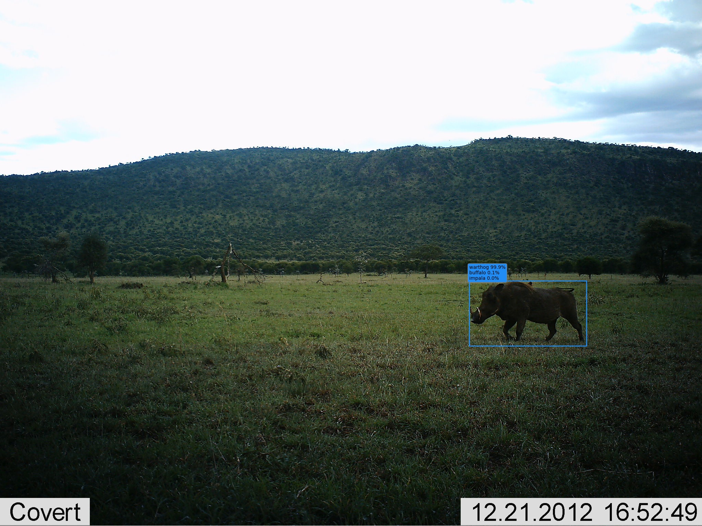

# Overview

This repo contains the tools for training, running, and evaluating detectors and classifiers for images collected from motion-triggered camera traps.  The core functionality provided is:

- Data parsing from frequently-used camera trap metadata formats into a common format
- Training and evaluation of detectors, particularly our &ldquo;MegaDetector&rdquo;, which does a pretty good job finding terrestrial animals in a variety of ecosystems
- Training and evaluation of species-level classifiers for specific data sets
- A Web-based demo that runs our models via a REST API that hosts them on a Web endpoint
- Miscellaneous useful tools for manipulating camera trap data
- Research experiments we&rsquo;re doing around camera trap data (i.e., some directories are highly experimental and you should take them with a grain of salt)

Classifiers and detectors are trained using TensorFlow.

This repo is maintained by folks in the [Microsoft AI for Earth](http://aka.ms/aiforearth) program who like looking at pictures of animals.  I mean, we want to use machine learning to support conservation too, but we also really like looking at pictures of animals.


# Data

This repo does not directly host camera trap data, but we work with our collaborators to make data and annotations available whenever possible on [lila.science](http://lila.science).


# Models

This repo does not extensively host models, though we will release models when they are at a level of generality that they might be useful to other people.  


## MegaDetector

Speaking of models that might be useful to other people, we have trained a one-class animal detector trained on several hundred thousand bounding boxes from a variety of ecosystems.  Lots more information &ndash; including download links &ndash; on the [MegaDetector page](megadetector.md).

Here&rsquo;s a &ldquo;teaser&rdquo; image of what detector output looks like:


Image credit University of Washington.

# Contact

For questions about this repo, contact [cameratraps@microsoft.com](mailto:cameratraps@microsoft.com).


# Contents

This repo is organized into the following folders...


## api

Code for hosting our models as an API, either for synchronous operation (e.g. for real-time inference or for our Web-based demo) or as a batch process (for large biodiversity surveys).


## classification

Code for training species classifiers on new data sets, generally trained on crops generated via an existing detector.  We&rsquo;ll release some classifiers soon, but more importantly, here&rsquo;s a [tutorial](https://github.com/microsoft/CameraTraps/blob/master/classification/TUTORIAL.md) on training your own classifiers from scratch using our detector and our training pipeline.

Oh, and here&rsquo;s another &ldquo;teaser image&rdquo; of what you get at the end of training a classifier:



## data_management

Code for:

- Converting frequently-used metadata formats to [COCO Camera Traps](https://github.com/Microsoft/CameraTraps/blob/master/data_management/README.md#coco-cameratraps-format) format
- Creating, visualizing, and  editing COCO Camera Traps .json databases
- Generating tfrecords

## demo

Source for the Web-based demo of our MegaDetector model (we&rsquo;ll release the demo soon!).


## detection

Code for training and evaluating detectors.


## research

Ongoing research projects that use this repository in one way or another; as of the time I&rsquo;m editing this README, there are projects in this folder around active learning and the use of simulated environments for training data augmentation.


## sandbox

Random things that don&rsquo;t fit in any other directory.  Currently contains a single file, a not-super-useful but super-duper-satisfying and mostly-successful attempt to use OCR to pull metadata out of image pixels in a fairly generic way, to handle those pesky cases when image metadata is lost.


# Gratuitous pretty camera trap picture


Image credit USDA, from the [NACTI](http://lila.science/datasets/nacti) data set.


# Installation

The required Python packages for running utility scripts in this repo are listed in [requirements.txt](requirements.txt). Here are some instructions for setting up a conda virtual environment with the required packages.

Python >= 3.5 should work. Create a virtual environment via conda called `cameratraps`, activates it, upgrade the Python package manager `pip`, and install the required packages:
```
conda create -n cameratraps python=3.5

source activate cameratraps

pip install --upgrade pip

pip install -r requirements.txt
```

In some scripts, we also assume that you have the [AI for Earth utilities repo](https://github.com/Microsoft/ai4eutils) cloned and its path appended to $PYTHONPATH.


# Contributing

This project welcomes contributions and suggestions.  Most contributions require you to agree to a
Contributor License Agreement (CLA) declaring that you have the right to, and actually do, grant us
the rights to use your contribution. For details, visit [cla.microsoft.com](https://cla.microsoft.com).

When you submit a pull request, a CLA-bot will automatically determine whether you need to provide
a CLA and decorate the PR appropriately (e.g., label, comment). Simply follow the instructions
provided by the bot. You will only need to do this once across all repos using our CLA.

This project has adopted the [Microsoft Open Source Code of Conduct](https://opensource.microsoft.com/codeofconduct/).
For more information see the [Code of Conduct FAQ](https://opensource.microsoft.com/codeofconduct/faq/) or
contact [opencode@microsoft.com](mailto:opencode@microsoft.com) with any additional questions or comments.

## License

This repository is licensed with the [MIT license](https://github.com/Microsoft/dotnet/blob/master/LICENSE).

