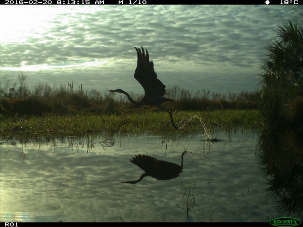

# Overview

This repo contains the tools for training, running, and evaluating detectors and classifiers for images collected from motion-triggered wildlife cameras.  The core functionality provided is:

- Training and running models, particularly [MegaDetector](megadetector.md), an object detection model that does a pretty good job finding animals, people, and vehicles (and therefore is pretty good at finding empty images) in a variety of terrestrial ecosystems
- Data parsing from frequently-used camera trap metadata formats into a common format
- A [batch processing API](https://github.com/ecologize/CameraTraps/tree/main/api/batch_processing) that runs MegaDetector on large image collections, to accelerate population surveys
- A [real-time API](https://github.com/ecologize/CameraTraps/tree/main/api/synchronous) that runs MegaDetector (and some species classifiers) synchronously, primarily to support anti-poaching scenarios (e.g. see this [blog post](https://customers.microsoft.com/en-us/story/1384184517929343083-wildlife-protection-solutions-nonprofit-ai-for-earth) describing how this API supports [Wildlife Protection Solutions](https://wildlifeprotectionsolutions.org/))

This repo is maintained by folks at [Ecologize](http://ecologize.org/) who like looking at pictures of animals.  We want to support conservation, of course, but we also really like looking at pictures of animals.

# What's MegaDetector all about?

The main model that we train and run using tools in this repo is [MegaDetector](megadetector.md), an object detection model that identifies animals, people, and vehicles in camera trap images.  This model is trained on several hundred thousand bounding boxes from a variety of ecosystems.  Lots more information &ndash; including download links and instructions for running the model &ndash; is available on the [MegaDetector page](megadetector.md).

Here's a "teaser" image of what detector output looks like:

Image credit University of Washington.

# How do I get started?

If you're just considering the use of AI in your workflow, and you aren't even sure yet whether MegaDetector would be useful to you, we recommend reading the "[getting started with MegaDetector](collaborations.md)" page.

If you're already familiar with MegaDetector and you're ready to run it on your data (and you have some familiarity with running Python code), see the [MegaDetector README](megadetector.md) for instructions on downloading and running MegaDetector.

# Who is using MegaDetector?

We work with ecologists all over the world to help them spend less time annotating images and more time thinking about conservation.  You can read a little more about how this works on our [getting started with MegaDetector](collaborations.md) page.

Here are a few of the organizations that have used MegaDetector... we're only listing organizations who (a) we know about and (b) have given us permission to refer to them here (or have posted publicly about their use of MegaDetector), so if you're using MegaDetector or other tools from this repo and would like to be added to this list, <a href="mailto:cameratraps@lila.science">email us</a>!

* [Arizona Department of Environmental Quality](http://azdeq.gov/)
* [Blackbird Environmental](https://blackbirdenv.com/)
* [Camelot](https://camelotproject.org/)
* [Canadian Parks and Wilderness Society (CPAWS) Northern Alberta Chapter](https://cpawsnab.org/)
* [Conservation X Labs](https://conservationxlabs.com/)
* [Czech University of Life Sciences Prague](https://www.czu.cz/en)
* [EcoLogic Consultants Ltd.](https://www.consult-ecologic.com/)
* [Estación Biológica de Doñana](http://www.ebd.csic.es/inicio)
* [Idaho Department of Fish and Game](https://idfg.idaho.gov/)
* [Island Conservation](https://www.islandconservation.org/)
* [Myall Lakes Dingo Project](https://carnivorecoexistence.info/myall-lakes-dingo-project/)
* [Point No Point Treaty Council](https://pnptc.org/)
* [Ramat Hanadiv Nature Park](https://www.ramat-hanadiv.org.il/en/)
* [SPEA (Portuguese Society for the Study of Birds)](https://spea.pt/en/)
* [Synthetaic](https://www.synthetaic.com/)
* [Taronga Conservation Society](https://taronga.org.au/)
* [The Nature Conservancy in Wyoming](https://www.nature.org/en-us/about-us/where-we-work/united-states/wyoming/)
* [TrapTagger](https://wildeyeconservation.org/trap-tagger-about/)
* [Upper Yellowstone Watershed Group](https://www.upperyellowstone.org/)

* [Applied Conservation Macro Ecology Lab](http://www.acmelab.ca/), University of Victoria
* [Banff National Park Resource Conservation](https://www.pc.gc.ca/en/pn-np/ab/banff/nature/conservation), Parks Canada
* [Blumstein Lab](https://blumsteinlab.eeb.ucla.edu/), UCLA
* [Borderlands Research Institute](https://bri.sulross.edu/), Sul Ross State University
* [Capitol Reef National Park](https://www.nps.gov/care/index.htm) / Utah Valley University
* [Center for Biodiversity and Conservation](https://www.amnh.org/research/center-for-biodiversity-conservation), American Museum of Natural History
* [Centre for Ecosystem Science](https://www.unsw.edu.au/research/), UNSW Sydney
* [Cross-Cultural Ecology Lab](https://crossculturalecology.net/), Macquarie University
* [DC Cat Count](https://hub.dccatcount.org/), led by the Humane Rescue Alliance
* [Department of Fish and Wildlife Sciences](https://www.uidaho.edu/cnr/departments/fish-and-wildlife-sciences), University of Idaho
* [Department of Wildlife Ecology and Conservation](https://wec.ifas.ufl.edu/), University of Florida
* [Ecology and Conservation of Amazonian Vertebrates Research Group](https://www.researchgate.net/lab/Fernanda-Michalski-Lab-4), Federal University of Amapá
* [Gola Forest Programma](https://www.rspb.org.uk/our-work/conservation/projects/scientific-support-for-the-gola-forest-programme/), Royal Society for the Protection of Birds (RSPB)
* [Graeme Shannon's Research Group](https://wildliferesearch.co.uk/group-1), Bangor University 
* [Hamaarag](https://hamaarag.org.il/), The Steinhardt Museum of Natural History, Tel Aviv University
* [Institut des Science de la Forêt Tempérée](https://isfort.uqo.ca/) (ISFORT), Université du Québec en Outaouais
* [Lab of Dr. Bilal Habib](https://bhlab.in/about), the Wildlife Institute of India
* [Mammal Spatial Ecology and Conservation Lab](https://labs.wsu.edu/dthornton/), Washington State University
* [McLoughlin Lab in Population Ecology](http://mcloughlinlab.ca/lab/), University of Saskatchewan
* [National Wildlife Refuge System, Southwest Region](https://www.fws.gov/about/region/southwest), U.S. Fish & Wildlife Service
* [Northern Great Plains Program](https://nationalzoo.si.edu/news/restoring-americas-prairie), Smithsonian
* [Quantitative Ecology Lab](https://depts.washington.edu/sefsqel/), University of Washington
* [Santa Monica Mountains Recreation Area](https://www.nps.gov/samo/index.htm), National Park Service
* [Seattle Urban Carnivore Project](https://www.zoo.org/seattlecarnivores), Woodland Park Zoo
* [Serra dos Órgãos National Park](https://www.icmbio.gov.br/parnaserradosorgaos/), ICMBio
* [Snapshot USA](https://emammal.si.edu/snapshot-usa), Smithsonian
* [Wildlife Coexistence Lab](https://wildlife.forestry.ubc.ca/), University of British Columbia
* [Wildlife Research](https://www.dfw.state.or.us/wildlife/research/index.asp), Oregon Department of Fish and Wildlife
* [Wildlife Division](https://www.michigan.gov/dnr/about/contact/wildlife), Michigan Department of Natural Resources

* Department of Ecology, TU Berlin
* Ghost Cat Analytics
* Protected Areas Unit, Canadian Wildlife Service

* [School of Natural Sciences](https://www.utas.edu.au/natural-sciences), University of Tasmania ([story](https://www.utas.edu.au/about/news-and-stories/articles/2022/1204-innovative-camera-network-keeps-close-eye-on-tassie-wildlife))
* [Kenai National Wildlife Refuge](https://www.fws.gov/refuge/kenai), U.S. Fish & Wildlife Service ([story](https://www.peninsulaclarion.com/sports/refuge-notebook-new-technology-increases-efficiency-of-refuge-cameras/))

* [Australian Wildlife Conservancy](https://www.australianwildlife.org/) ([blog](https://www.australianwildlife.org/cutting-edge-technology-delivering-efficiency-gains-in-conservation/), [blog](https://www.australianwildlife.org/efficiency-gains-at-the-cutting-edge-of-technology/))
* [Felidae Conservation Fund](https://felidaefund.org/) ([WildePod platform](https://wildepod.org/)) ([blog post](https://abhaykashyap.com/blog/ai-powered-camera-trap-image-annotation-system/))
* [Alberta Biodiversity Monitoring Institute (ABMI)](https://www.abmi.ca/home.html) ([WildTrax platform](https://www.wildtrax.ca/)) ([blog post](https://wildcams.ca/blog/the-abmi-visits-the-zoo/))
* [Shan Shui Conservation Center](http://en.shanshui.org/) ([blog post](https://mp.weixin.qq.com/s/iOIQF3ckj0-rEG4yJgerYw?fbclid=IwAR0alwiWbe3udIcFvqqwm7y5qgr9hZpjr871FZIa-ErGUukZ7yJ3ZhgCevs)) ([translated blog post](https://mp-weixin-qq-com.translate.goog/s/iOIQF3ckj0-rEG4yJgerYw?fbclid=IwAR0alwiWbe3udIcFvqqwm7y5qgr9hZpjr871FZIa-ErGUukZ7yJ3ZhgCevs&_x_tr_sl=auto&_x_tr_tl=en&_x_tr_hl=en&_x_tr_pto=wapp))
* [Irvine Ranch Conservancy](http://www.irconservancy.org/) ([story](https://www.ocregister.com/2022/03/30/ai-software-is-helping-researchers-focus-on-learning-about-ocs-wild-animals/))
* [Wildlife Protection Solutions](https://wildlifeprotectionsolutions.org/) ([story](https://customers.microsoft.com/en-us/story/1384184517929343083-wildlife-protection-solutions-nonprofit-ai-for-earth), [story](https://www.enterpriseai.news/2023/02/20/ai-helps-wildlife-protection-solutions-safeguard-endangered-species/))

* [Road Ecology Center](https://roadecology.ucdavis.edu/), University of California, Davis ([Wildlife Observer Network platform](https://wildlifeobserver.net/))
* [The Nature Conservancy in California](https://www.nature.org/en-us/about-us/where-we-work/united-states/california/) ([Animl platform](https://github.com/tnc-ca-geo/animl-frontend))
* [San Diego Zoo Wildlife Alliance](https://science.sandiegozoo.org/)  ([Animl R package](https://github.com/conservationtechlab/animl))

# Data

This repo does not directly host camera trap data, but we work with our collaborators to make data and annotations available whenever possible on [lila.science](http://lila.science).

# Contact

For questions about this repo, contact [cameratraps@lila.science](mailto:cameratraps@lila.science).

# Contents

This repo is organized into the following folders...

## api

Code for hosting our models as an API, either for synchronous operation (i.e., for real-time inference) or as a batch process (for large biodiversity surveys).  Common operations one might do after running MegaDetector &ndash; e.g. [generating preview pages to summarize your results](https://github.com/ecologize/CameraTraps/blob/main/api/batch_processing/postprocessing/postprocess_batch_results.py), [separating images into different folders based on AI results](https://github.com/ecologize/CameraTraps/blob/main/api/batch_processing/postprocessing/separate_detections_into_folders.py), or [converting results to a different format](https://github.com/ecologize/CameraTraps/blob/main/api/batch_processing/postprocessing/convert_output_format.py) &ndash; also live in this folder, within the [api/batch_processing/postprocessing](https://github.com/ecologize/CameraTraps/tree/main/api/batch_processing/postprocessing) folder.

## classification

Experimental code for training species classifiers on new data sets, generally trained on MegaDetector crops.  Currently the main pipeline described in this folder relies on a large database of labeled images that is not publicly available; therefore, this folder is not yet set up to facilitate training of your own classifiers.  However, it is useful for <i>users</i> of the classifiers that we train, and contains some useful starting points if you are going to take a "DIY" approach to training classifiers on cropped images.  

All that said, here's another "teaser image" of what you get at the end of training and running a classifier:

## data_management

Code for:

* Converting frequently-used metadata formats to [COCO Camera Traps](https://github.com/ecologize/CameraTraps/blob/main/data_management/README.md#coco-cameratraps-format) format
* Converting the output of AI models (especially [YOLOv5](https://github.com/ecologize/CameraTraps/blob/main/api/batch_processing/postprocessing/convert_output_format.py)) to the format used for AI results throughout this repo
* Creating, visualizing, and  editing COCO Camera Traps .json databases

## detection

Code for training, running, and evaluating MegaDetector.

## research

Ongoing research projects that use this repository in one way or another; as of the time I'm editing this README, there are projects in this folder around active learning and the use of simulated environments for training data augmentation.

## sandbox

Random things that don't fit in any other directory.  For example:

* A not-super-useful but super-duper-satisfying and mostly-successful attempt to use OCR to pull metadata out of image pixels in a fairly generic way, to handle those pesky cases when image metadata is lost.
* Experimental postprocessing scripts that were built for a single use case

## taxonomy-mapping

Code to facilitate mapping data-set-specific categories (e.g. "lion", which means very different things in Idaho vs. South Africa) to a standard taxonomy.

## test-images

A handful of images from [LILA](https://lila.science) that facilitate testing and debugging.

## visualization

Shared tools for visualizing images with ground truth and/or predicted annotations.

# Gratuitous pretty camera trap picture

Image credit USDA, from the [NACTI](http://lila.science/datasets/nacti) data set.

## License

This repository is licensed with the [MIT license](https://github.com/Microsoft/dotnet/blob/main/LICENSE).
