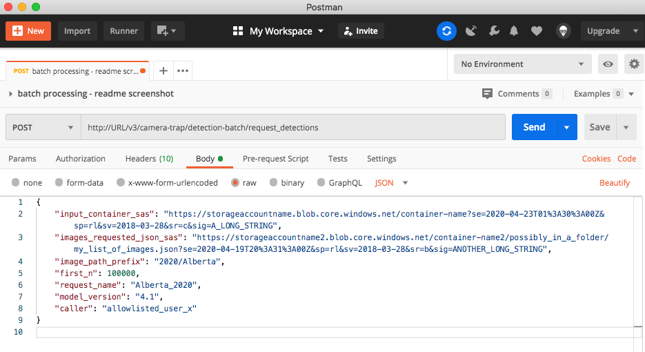

# Camera trap batch processing API user guide

Though most of our users either use the [MegaDetector](https://github.com/Microsoft/CameraTraps#megadetector) model directly or work with us to run MegaDetector on the cloud, we also offer an open-source reference implementation for a an API that processes a large quantity of camera trap images, to support  a variety of online scenarios. The output is most helpful for separating empty from non-empty images based on a detector confidence threshold that you select, and putting bounding boxes around animals, people, and vehicles to help manual review proceed more quickly.  If you are interested in setting up an endpoint to process very small numbers of images for real-time applications (e.g. for anti-poaching applications), see the source for our [real-time camera trap image processing API](https://aiforearth.portal.azure-api.net/docs/services/ai-for-earth-camera-trap-detection-api/).

With the batch processing API, you can process a batch of up to a few million images in one request to the API. If in addition you have some images that are labeled, we can evaluate the performance of the MegaDetector on your labeled images (see [Post-processing tools](#post-processing-tools)).

All references to &ldquo;container&rdquo; in this document refer to [Azure Blob Storage](https://azure.microsoft.com/en-us/services/storage/blobs/) containers.

We have referred to one submission of images as a "request" in this documentation but as a "job" elsewhere in the source code and emails; confusingly, the endpoint for checking the status of a request/job is called `/task` and the RequestID is called `task_id`. Consider "request" and "job" interchangeable, and the `/task` endpoint a legacy issue. Note that the terms "job" and "task" mean different things in the source code (in the context of Azure Batch).


## API

### API endpoints

Once configured to run on a live instance, the endpoints of this API are available at

```
http://URL/v4/camera-trap/detection-batch
```

#### `/request_detections`

To submit a request for batch processing, make a POST call to this endpoint with a json body containing input fields defined below. The API will return with a json response very quickly to give you a RequestID (UUID4 hex) representing the request you have submitted, for example:
```json
{
  "request_id": "f940ecd58c7746b1bde89bd6ba5a5202"
}
```
or an error message, if your inputs are not acceptable:
```json
{
  "error": "error message."
}
```
In particular the endpoint will return a 503 error if the queue of requests is full. Please re-try later in that case.


#### `/task`

Check the status of your request by calling the `/task` endpoint via a GET call, passing in your RequestID:

```http://URL/v4/camera-trap/detection-batch/task/RequestID```

This returns a json with the fields `Status`, `TaskId` (which is the `request_id` in this document), and a few others. The `Status` field is a json object with the following fields: 

- `request_status`: one of `running`, `failed`, `problem`, `completed`, and `canceled`. 
    - The status `failed` indicates that the images have not been submitted to the cluster for processing, and so you can go ahead and call the `\request_detections` endpoint again, correcting your inputs according to the error message returned with the status. 
    - The status `problem` indicates that the images have already been submitted for processing but the API encountered an error while monitoring progress; in this case, please contact us to retrieve your results so that no unnecessary processing would occupy the cluster (`message` field will mention "please contact us").
    - `canceled` if your call to the `/cancel_request` endpoint took effect.

- `message`: a longer string describing the `request_status` and any errors; when the request is completed, the URLs to the output files will also be here (see [Outputs](#23-outputs) section below).


#### `/supported_model_versions`
Check which versions of the MegaDetector are supported by this API by making a GET call to this endpoint.

#### `/default_model_version`
Check which version of the MegaDetector is used by default by making a GET call to this endpoint.

#### `/cancel_request`
If you have submitted a request by mistake, you can make a POST call to this endpoint to cancel it.

The body should contain the `caller` (see next section on _API inputs_) and `request_id` fields. You should get back a response immediately with status code 200 if the signal was successfully sent. You can verify that the request has been canceled using the `/task` endpoint. 


### API inputs

| Parameter                | Is required | Type | Explanation                 |
|--------------------------|-------------|-------|----------------------------|
| input_container_sas      | Yes<sup>1</sup>         | string | SAS URL with list and read permissions to the Blob Storage container where the images are stored. |
| images_requested_json_sas | No<sup>1</sup>        | string | SAS URL with list and read permissions to a json file in Blob Storage. See below for explanation of the content of the json to provide. |
| image_path_prefix        | No          | string | Only process images whose full path starts with `image_path_prefix` (case-_sensitive_). Note that any image paths specified in `images_requested_json_sas` will need to be the full path from the root of the container, regardless whether `image_path_prefix` is provided. |
| first_n                  | No          | int | Only process the first `first_n` images. Order of images is not guaranteed, but is likely to be alphabetical. Set this to a small number to avoid taking time to fully list all images in the blob (about 15 minutes for 1 million images) if you just want to try this API. |
| sample_n                | No          | int | Randomly select `sample_n` images to process. |
| model_version           | No          | string | Version of the MegaDetector model to use. Default is the most updated stable version (check using the `/default_model_version` endpoint). Supported versions are available at the `/supported_model_versions` endpoint.|
| request_name            | No          | string | A string (letters, digits, `_`, `-` allowed, max length 92 characters) that will be appended to the output file names to help you identify the resulting files. A timestamp in UTC (`%Y%m%d%H%M%S`) of the time of submission will be appended to the resulting files automatically. |
| use_url                  | No         | bool | Set to `true` if you are providing public image URLs. |
| caller                  | Yes         | string | An identifier that we use to whitelist users for now. |
| country                  | No (but recommended) | string | Country where the majority of the images in this batch are taken. Preferably use an [ISO 3166-1 alpha-3 code](https://en.wikipedia.org/wiki/ISO_3166-1_alpha-3#Officially_assigned_code_elements), such as "BWA" for Botswana and "USA" for the United States |
| organization_name | No (but recommended) | string | Organization conducting the survey. |


<sup>1</sup> There are two ways of giving the API access to your images. 

1 - If you have all your images in a container in Azure Blob Storage, provide the parameter `input_container_sas` as described above. This means that your images do not have to be at publicly accessible URLs. In this case, the json pointed to by `images_requested_json_sas` should look like:
```json
[
  "Season1/Location1/Camera1/image1.jpg", 
  "Season1/Location1/Camera1/image2.jpg"
]
```
Only images whose paths are listed here will be processed if you provide this list.

2 - If your images are stored elsewhere and you can provide a publicly accessible URL to each, you do not need to specify `input_container_sas`. Instead, list the URLs to all the images (instead of their paths) you&rsquo;d like to process in the json at `images_requested_json_sas`.


#### Attaching metadata

We can store a (short) string of metadata with each image path or URL. The json at `images_requested_json_sas` should then look like:
```json
[
  ["Season1/Location1/Camera1/image1.jpg", "metadata_string1"], 
  ["Season1/Location1/Camera1/image2.jpg", "metadata_string2"]
]
``` 
The metadata string will be copied to the `meta` field in the image's entry in the output file (format see below).


#### Other notes and example  

- Only images with file name ending in ".jpg", ".jpeg" or ".png" (case insensitive) will be processed, so please make sure the file names are compliant before you upload them to the container (you cannot rename a blob without copying it entirely once it is in Blob Storage). 

- By default we process all such images in the specified container. You can choose to only process a subset of them by specifying the other input parameters. The images will be filtered out accordingly in this order:
    - `images_requested_json_sas`
    - `image_path_prefix`
    - `first_n`
    - `sample_n`
    
    - For example, if you specified both `images_requested_json_sas` and `first_n`, only images that are in your provided list at `images_requested_json_sas` will be considered, and then we process the `first_n` of those.

Example body of the POST request:
```json
{
  "input_container_sas": "https://storageaccountname.blob.core.windows.net/container-name?se=2019-04-23T01%3A30%3A00Z&sp=rl&sv=2018-03-28&sr=c&sig=A_LONG_STRING",
  "images_requested_json_sas": "https://storageaccountname2.blob.core.windows.net/container-name2/possibly_in_a_folder/my_list_of_images.json?se=2019-04-19T20%3A31%3A00Z&sp=rl&sv=2018-03-28&sr=b&sig=ANOTHER_LONG_STRING",
  "image_path_prefix": "2020/Alberta",
  "first_n": 100000,
  "request_name": "Alberta_2020",
  "model_version": "4.1",
  "caller": "allowlisted_user_x",
  "country": "CAN",
  "organization_name": "Name of Organization"
}
```

You can manually call the API using applications such as Postman:




#### How to obtain a SAS token

You can easily generate a [SAS token](https://docs.microsoft.com/en-us/azure/storage/common/storage-dotnet-shared-access-signature-part-1) to a container using the desktop app [Azure Storage Explorer](https://azure.microsoft.com/en-us/features/storage-explorer/) (available on Windows, macOS and Linux). You can also issue SAS tokens programmatically by using the [Azure Storage SDK](https://azure-storage.readthedocs.io/ref/azure.storage.blob.baseblobservice.html#azure.storage.blob.baseblobservice.BaseBlobService.generate_blob_shared_access_signature).


Using Storage Explorer, right click on the container or blob you&rsquo;d like to grant access for, and choose &ldquo;Get Shared Access Signature...&rdquo;. On the dialog window that appears, 
- cross out the &ldquo;Start time&rdquo; field if you will be using the SAS token right away
- set the &ldquo;Expiry time&rdquo; to a date in the future, about a month ahead is reasonable. The SAS token needs to be valid for the duration of the batch processing request. 
- make sure &ldquo;Read&rdquo; and &ldquo;List&rdquo; are checked under &ldquo;Permissions&rdquo; (see screenshot) 

Click &ldquo;Create&rdquo;, and the &ldquo;URL&rdquo; field on the next screen is the value required for `input_container_sas` or `images_requested_json_sas`. 


### API outputs

Once your request is submitted and parameters validated, the API divides all images into shards of about 2000 images each, and send them to an [Azure Batch](https://azure.microsoft.com/en-us/services/batch/) node pool to be scored by the model. Another process will monitor how many shards have been evaluated, checking every 15 minutes, and update the status of the request, which you can check via the `/task` endpoint. 

When all shards have finished processing, the `status` returned by the `/task` endpoint will have the `request_status` field as `completed`, and the `message` field will contain a URL to the output file. The returned body looks like

```json
{
    "Status": {
        "request_status": "completed",
        "message": {
            "num_failed_shards": 0,
            "output_file_urls": {
                "detections": "https://cameratrap.blob.core.windows.net/async-api-internal/ee26326e-7e0d-4524-a9ea-f57a5799d4ba/ee26326e-7e0d-4524-a9ea-f57a5799d4ba_detections_4_1_on_test_images_20200709211752.json?sv=2019-02-02&sr=b&sig=key1"
            }
        },
        "time": "2020-07-09 21:27:17"
    },
    "Timestamp": "2020-07-09 21:27:17",
    "Endpoint": "/v3/camera-trap/detection-batch/request_detections",
    "TaskId": "ea26326e-7e0d-4524-a9ea-f57a5799d4ba"
}
```
 
To obtain the URL of the output file:
```python
task_status = body['Status']
assert task_status['request_status'] == 'completed'
message = task_status['message']
assert message['num_failed_shards'] == 0

url_to_results_file = message['output_file_urls']['detections']
```
Note that the field `Status` in the returned body is capitalized (since July 2020).

The URL to the output file is valid for 180 days from the time the request has finished. If you neglected to retrieve them before the link expired, contact us with the RequestID and we can send the results to you. 

The output file is a JSON in the format described below.


#### Batch processing API output format

The output of the detector is saved in `requestID_detections_requestName_timestamp.json`. The `classifications` fields will be added if a classifier was trained for your project and applied to the images. 

If an image could not be opened or an error occurred when applying the model to it, it will still have an entry in the output file images list, but it will have a `failure` field indicating the type of error (see last entry in the example below). However, if the API runs into problems processing an entire shard of images (usually 2000 images per shard), they will not have entries in the results file - this should be very rare.

Example output with both detection and classification results:

```json
{
    "info": {
        "format_version": "1.2",
        "detector": "md_v4.1.0.pb",
        "detection_completion_time": "2019-05-22 02:12:19",
        "classifier": "ecosystem1_v2",
        "classification_completion_time": "2019-05-26 01:52:08",
        "detector_metadata": {
           "megadetector_version":"v4.1.0",
           "typical_detection_threshold":0.8,
           "conservative_detection_threshold":0.6
        }
        "classifier_metadata": {
           "typical_classification_threshold":0.75
        }
    },
    "detection_categories": {
        "1": "animal",
        "2": "person",
        "3": "vehicle"
    },
    "classification_categories": {
        "0": "fox",
        "1": "elk",
        "2": "wolf",
        "3": "bear",
        "4": "moose"
    },
    "images": [
        {
            "file": "path/from/base/dir/image1.jpg",
            "meta": "optional free-text metadata",
            "max_detection_conf": 0.926,
            "detections": [
                {
                    "category": "1",
                    "conf": 0.926,
                    "bbox": [0.0, 0.2762, 0.1539, 0.2825], 
                    "classifications": [
                        ["3", 0.901],
                        ["1", 0.071],
                        ["4", 0.025]
                    ]
                },
                {
                    "category": "1",
                    "conf": 0.061,
                    "bbox": [0.0451, 0.1849, 0.3642, 0.4636]
                }
            ]
        },
        {
            "file": "/path/from/base/dir/image2.jpg",
            "meta": "",
            "max_detection_conf": 0,
            "detections": []
        },
        {
            "file": "/path/from/base/dir2/corrupted.jpg",
            "failure": "Failure image access"
        }
    ]
}
```

##### Model metadata

The 'detector' field (within the 'info' field) specifies the filename of the detector model that produced this results file.  It was omitted in old files generated with run_detector_batch.py, so with extremely high probability, if this field is not present, you can assume the file was generated with MegaDetector v4.

In newer files, this should contain the filename (base name only) of the model file, which typically will be one of:

* megadetector_v4.1 (MegaDetector v4, run via the batch API) 
* md_v4.1.0.pb (MegaDetector v4, run locally) 
* md_v5a.0.0.pt (MegaDetector v5a) 
* md_v5b.0.0.pt (MegaDetector v5b) 

This string is used by some tools to choose appropriate default confidence values, which depend on the model version.  If you change the name of the MegaDetector file, you will break this convention, and YMMV.
 
The "detector_metadata" and "classifier_metadata" fields are also optionally added as of format version 1.2.  These currently contain useful default confidence values for downstream tools (particularly Timelapse), but we strongly recommend against blindly trusting these defaults; always explore your data before choosing a confidence threshold, as the optimal value can vary widely.

##### Detector outputs

The bounding box in the `bbox` field is represented as

```
[x_min, y_min, width_of_box, height_of_box]
```

where `(x_min, y_min)` is the upper-left corner of the detection bounding box, with the origin in the upper-left corner of the image. The coordinates and box width and height are *relative* to the width and height of the image. Note that this is different from the coordinate format used in the [COCO Camera Traps](data_management/README.md) databases, which are in absolute coordinates. 

The detection category `category` can be interpreted using the `detection_categories` dictionary. 

Detection categories not listed here are allowed by this format specification, but should be treated as "no detection".

When the detector model detects no animal (or person or vehicle), the confidence `conf` is shown as 0.0 (not confident that there is an object of interest) and the `detections` field is an empty list.

All detections above the confidence threshold of 0.1 are recorded in the output file.


##### Classifier outputs

After a classifier is applied, each tuple in a `classifications` list represents `[species, confidence]`. They are listed in order of confidence. The species categories should be interpreted using the `classification_categories` dictionary.  Keys in `classification_categories` will always be nonnegative integers formatted as strings.


## Post-processing tools

The [postprocessing](postprocessing) folder contains tools for working with the output of our detector API.  In particular, [postprocess_batch_results.py](postprocessing/postprocess_batch_results.py) provides visualization and accuracy assessment tools for the output of the batch processing API. A sample output for the Snapshot Serengeti data when using ground-truth annotations can be seen [here](http://dolphinvm.westus2.cloudapp.azure.com/data/snapshot_serengeti/serengeti_val_detections_from_pkl_MDv1_20190528_w_classifications_eval/).


## Integration with other tools

The [integration](integration) folder contains guidelines and postprocessing scripts for using the output of our API in other applications.
