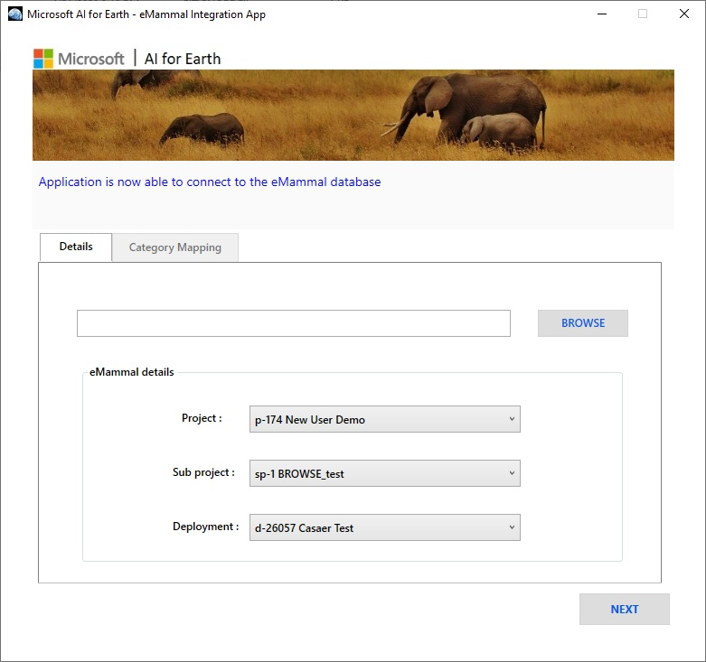
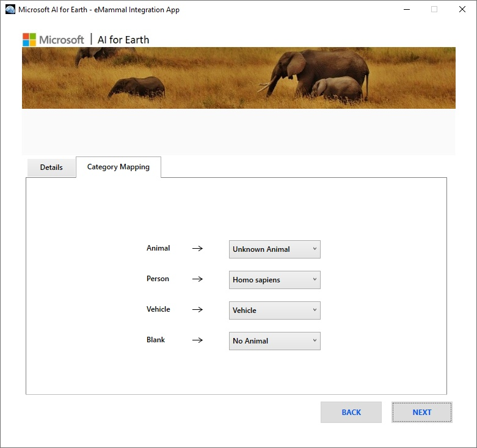
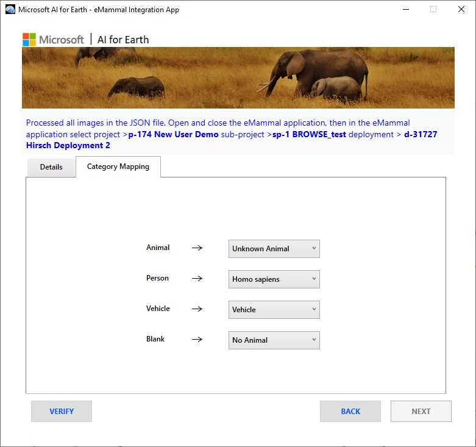
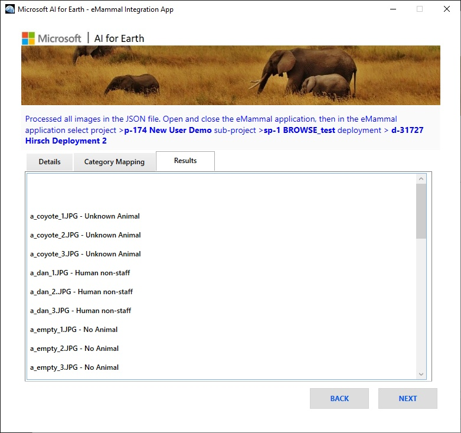

# MegaDetector/eMammal integration app: introduction 

This app takes as input an output file from the AI for Earth MegaDetector batch API and transfers those annotations to the eMammal desktop app running on the local machine.  This is very very very very beta, so if you're interested in trying this out, we recommend that you <a href="mailto:cameratraps@lila.science">email us</a>!

We have also worked with a number of eMammal users to use MegaDetector in a somewhat less elegant way, specifically to process all their images before they ever get to the eMammal desktop app, and use the MegaDetector results move all the empty images into a separate folder, which users can then either upload to a separate deployment or not upload at all.  We can do the same with human/vehicle images.  If you're interested in trying this approach out, also <a href="mailto:cameratraps@lila.science">email us</a>!

# Downloading the eMammal integration app

Download from <a href="https://lilablobssc.blob.core.windows.net/models/apps/megadetector-eMammal-integration-app.1.00.zip">here</a>.

# Downloading the eMammal desktop app

If you're reading this, you probably already have the eMammal desktop app, and we're not going to post a link here, but the installer you downloaded should look something like "EMammal_Desktop-0.9.32.exe".  0.9.32 is the most recent version we've tested our integration tool against.

User-facing documentation for the eMammal desktop app (for a slightly different version, but close) is available here:

* <https://emammal.si.edu/content/emammal-training> 
* <https://www.youtube.com/watch?v=3x4JwHEMtFg&feature=emb_logo>

If you face any issues during installation of the eMammal desktop app, refer to [eMammal-Client-App-Troubleshooting.md](eMammal-Client-App-Troubleshooting.md).

# Using the eMammal integration app

## Run the eMammal desktop app and load images

1. Run the eMammal desktop app, click "Load New Photos", then select the project, sub-project, and deployment. It doesn't matter which subj-project/deployment you select; you won't be pushing anything to the cloud during testing.

2. Load the images into the eMammal desktop app by selecting a folder, which eMammal will recursively search for images.  eMammal will remember the path of each image relative to the base folder you pick, and these relative paths need to match the .json file.  So if your .json file has images like:

`a/b/c/d/image0001.jpg`

You should make sure that the "a" folder is somewhere all by itself, and select the folder above it, even if all the images are way down in the "c" folder.  Of course you can also manipulate the .json file to match, but one way or another they need to line up.

3. Leave the app running.

## Run the AI for Earth eMammal integration app

1. Run the AI for Earth eMammal integration app.

2. Select the .json detection file for the images you loaded above.

3. Select the eMammal project and deployment you selected above.

&nbsp;&nbsp;&nbsp;&nbsp;&nbsp;&nbsp;&nbsp;&nbsp;&nbsp;&nbsp; 

4. Click "next", then in the next screen for <i>Category Mapping</i>, select the eMammal categories from the drop-down list to which you want to match each of the four MegaDetector categories ("Animal", "Person", "Vehicle", and "Blank").  These will by default be mapped to the eMammal categories "Unknown Animal", "Homo sapiens", "Vehicle", and "No Animal", respectively.

&nbsp;&nbsp;&nbsp;&nbsp;&nbsp;&nbsp;&nbsp;&nbsp;&nbsp;&nbsp; 

5. Click "next" to add annotations to the eMammal database. Once all the annotations have been added to the database, you will see a message confirming the successful deployment, asking you to close and re-open the eMammal desktop app (step (1) below).  

&nbsp;&nbsp;&nbsp;&nbsp;&nbsp;&nbsp;&nbsp;&nbsp;&nbsp;&nbsp; 

6. Once you've closed and re-opened the eMammal desktop app, you can click the "verify" button to confirm that all of the image assignments worked correctly:

&nbsp;&nbsp;&nbsp;&nbsp;&nbsp;&nbsp;&nbsp;&nbsp;&nbsp;&nbsp; 

## View annotations in the eMammal desktop app

1. Close and re-open the eMammal desktop app

2. Sign in and and click "Load New Photos"

3. Select the same project and deployment you selected above

4. Click "continue", then in the next window click "Save Deployment Info". In the main window of the eMammal app, annotations for the images should appear reflecting the maximum confidence value for each image in a sequence.

5. Play around with the annotations, but - if you're an AI for Earth person reading this during development - <b>do not click "upload"</b>; we have been asked not to push annotations to the test deployment.  It won't be catastrophic if you do, but we said we wouldn't.  If you're an eMammal user, by all means, upload away!

