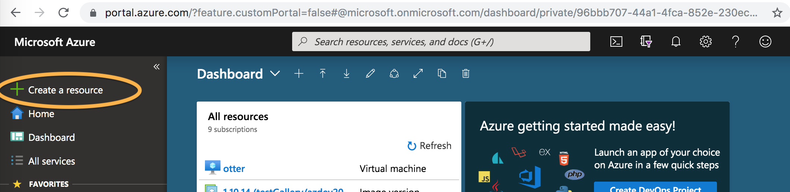
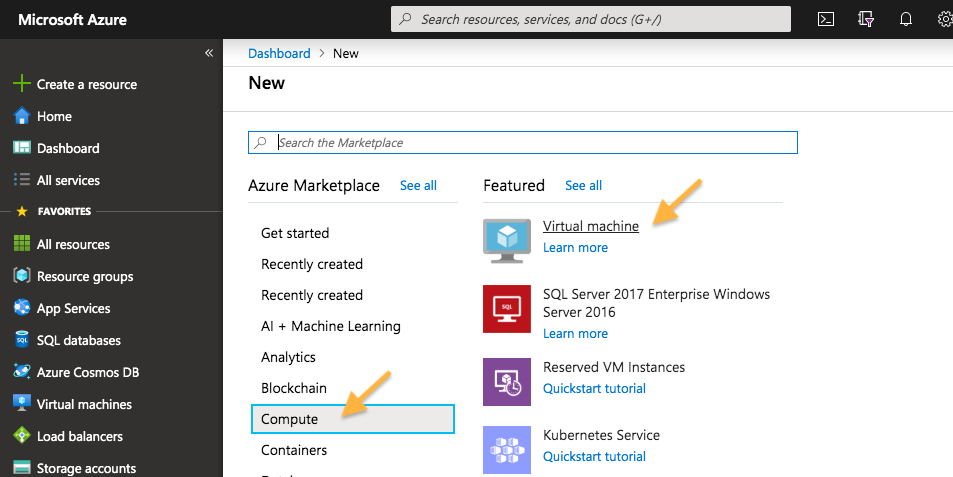
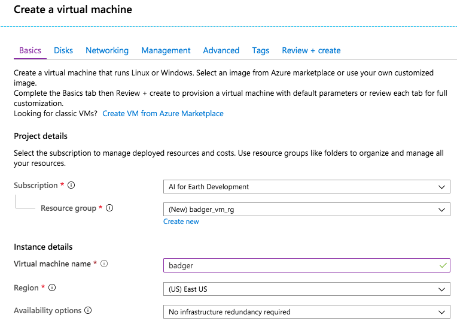
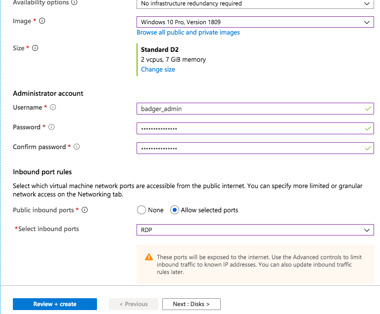
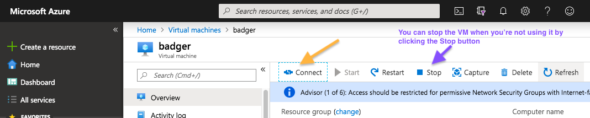
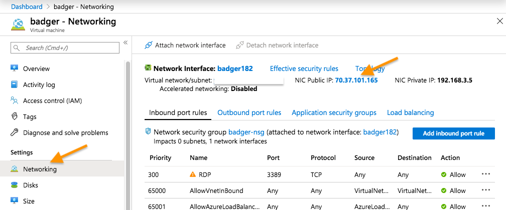
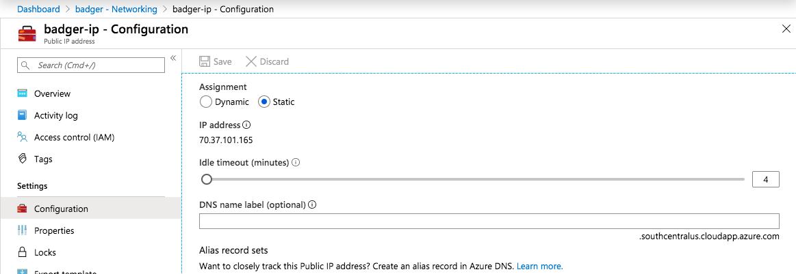

# Setting up Windows Remote Desktop 

This guide documents how to set up Window Virtual Machines (VMs) on Azure and add users to them. This could be useful for distributing image labeling tasks using e.g. Timelapse to other team members.

Where not noted, it is fine to accept the default value provided by Azure Portal. The screenshot relevant to a series of steps is shown below the text.

### What is a virtual machine?
A virtual machine is a computer simulated by software to have the same functionality as a physical computer. A VM in Azure is such a simulated computer that runs on a physical computer in an Azure data center. As a user, you can treat a VM as you would a normal computer. 

To access this VM, we use the same mechanism as for accessing any computer in a remote location, which is "remote desktop." This is a type of software run on your local computer that transmits the graphical user interface of the remote computer to you. 

## Create a Windows VM on Azure Portal

Visit Azure Portal at [https://portal.azure.com](https://portal.azure.com). This is where you can manage the resources in your Azure subscription. Authenticate with your credentials associated with the subscription.

On the menu on the left (if hidden, expand by clicking on the hamburger icon), select the first option "Create a resource". 

On the subsequent interface, find the "Compute" category under "Azure Marketplace." Then, click on "Virtual  machine".

### VM settings

On the subsequent "Create a virtual machine" page, in the "Basic" tab (default), select the Subscription that you will use for this VM. Then under the dropdown for "Resource group", click on "Create new" to create a Resource Group for this VM and the other Azure resources that will be created automatically to support it. Give this new Resource Group a name. We name our VMs after animals, so here we call this Resource Group "badger_vm_rg". Fill in the name of the VM in the next textbox (here it is "badger").

Next we choose a "Region" to deploy this VM to. It is very important that you *select the same Region as where you have stored your data* so that data can be read quickly.

For the Image option that specifies the operating system variant, select one of the "Windows 10 Pro" options from the dropdown.

You can leave the Size selection to the default or select a more/less powerful computer to suit your workload. You can change this after the VM is deployed too. 

In the "Administrator account" section, choose a username and password. You will need this later to log in to the VM and set up other users' accounts. 

In the "Inbound port rules" section, make sure you check the "Allow selected ports" radio button and check "RDP" in the dropdown below that. This allows you to access the VM using remote desktop (RDP: Remote Desktop Protocol). 

Once you're happy with the settings, proceed to click on "Review + create." You should not need to modify options in the other tabs besides "Basic."

The Portal then takes a few seconds to validate your settings and will show a "Validation passed" message once it finishes. You can then click on "Create." 

You will be taken to a new page that shows the progress of creating various resources to support the VM and the VM itself. This may take a few minutes. 

Once the VM has been created, you can find its "home page" by selecting "Virtual machines" on the menu on the left and choose its entry. If you don't have "Virtual machines" as an option on the menu, search "virtual machine" in the search bar at the top of the Portal's page. You can also directly search for the name of the VM in the search bar to access its home page.

## Connect to the VM

You can manage the VM from its home page. At the top of the Overview page, you will find buttons to Stop and Start the VM. When you're not using the VM, you can stop ("deallocate") it so that your subscription does not get charged. You *don't* need to delete the VM - deleting it means that you need to go through the creation process above next time.

Now click on the "Connect" button to open a side panel. 

On this side panel, under the "RDP" tab (default), click on "Download RDP File" to download a .rdp text file.

You will then need the "Microsoft Remote Desktop" application on your local computer to access the VM (available for free from Microsoft Store [here](https://www.microsoft.com/en-us/p/microsoft-remote-desktop/9wzdncrfj3ps?activetab=pivot:overviewtab) and the Mac App Store [here](https://apps.apple.com/us/app/microsoft-remote-desktop/id714464092)). Once installed, double clicking on the RDP file should get the application started, from which you can operate the VM.

### Side step: make the IP address of the VM static
The IP address of the VM is by default dynamic and can change over time (especially after re-starts). When this happens, the RDP file will become outdated and you need to download a new one to continue. If you don't want to deal with this, you can set the IP address to be static:

1 - On the VM's home page, select the "Networking" setting section. Then, click on the public IP address (indicated by arrow in the screenshot below).

2 - In the subsequent interface, select "Configuration" from the menu on the left, and check the "Static" radio button.

After making this change, any RDP files you then download should remain valid. 

## Add additional users

Once you are able to operate the VM using Microsoft Remote Desktop, you can add additional users to the VM as you can on any Windows computer. Here is a [guide](https://support.microsoft.com/en-us/help/4026923/windows-10-create-a-local-user-or-administrator-account).

Note that as any Windows computer, the VM can only be operated on by one user at a time. So you could also give the admin credentials to the people assigned to process the images and skip this step.

## Install Azure Storage Explorer for data access

You can now go ahead to install applications such as Timelapse on the VM and download the results generated by our API. To access the camera trap images on the VM, you need to download them from Azure Blob Storage (these images were previously uploaded so that the batch processing API could access them). You can use Azure Storage Explorer to do that (download from [here](https://azure.microsoft.com/en-us/features/storage-explorer/)). 

Once you have it installed, you will be prompted to "Connect to Azure Storage," which you can do by signing into your Azure Account or through a shared access signature (SAS) URI that we provide you with, depending on where your data is stored.

! Make sure you enable the AzCopy (currently in Preview) feature - it makes a big difference in download speed: on the top menu bar, go to "Preview" and check "Use AzCopy for Improved Blob Upload and Download."

You should be able to browse the images in a blob storage container and select folders to download to the VM.
