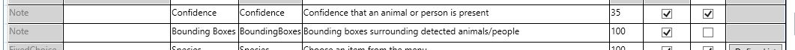

# Overview

[Timelapse](http://saul.cpsc.ucalgary.ca/timelapse/) is an open-source tool for annotating camera trap images.  We have worked with the Timelapse developer to integrate the output of our API into Timelapse, so a user can:

- Select or sort images based on whether they contain people or animals
- View bounding boxes during image annotation (which can speed up review)

This page contains instructions about how to load our API output into Timelapse.  It assumes familiarity with Timelapse, most importantly with the concept of Timlapse templates.

# Download the ML-enabled version of Timelapse

This feature is not in the stable release of Timelapse yet; you can download from (obfuscated URL) or, if you&rsquo;re feeling ambitious, you can build from source on the [machinelearning-experimental](https://github.com/saulgreenberg/Timelapse/tree/machinelearning-experimental) branch of the Timelapse repo.

# Prepare your Timelapse template 

Using the Timelapse template editor, add two fields to your template (which presumably already contains lots of other things specific to your project):

- <i>Confidence</i> (of type &ldquo;note&rdquo;, i.e., string)
- <i>BoundingBoxes</i> (of type &ldquo;note&rdquo;, i.e., string)

These fields will be used internally by Timelapse to store the results you load from our API.

A sample template containing these fields is available [here](MLDebugTemplate.tdb).

# Create your Timelapse database

...exactly the way you would for any other Timelapse project.  Specifically, put your .tdb file in the root directory of your project, and load it with file &rarr; load template, then let it load all the images (can take a couple hours if you have millions of images).  This should create your database (.ddb file).

# Prepare API output for Timelapse

This is a temporary step, used only while we're reconciling the output format expected by Timelapse with the output format currently produced by our API.

Use the script [prepare_api_output_for_timelapse.py](prepare_api_output_for_timelapse.py).  Because this is temporary, I&rsquo;m not going to document it here, but the script is reasonably well-commented.

# Load ML results into Timelapse

Click recognition &rarr; import recognition data, and point it to the Timelapse-ready .csv file.  It doesn&rsquo;t matter where this file is, though it&rsquo; probably cleanest to put it in the same directory as your template/database.

This step can also take a few hours if you have lots of images.

# Do useful stuff with your ML results!

Now that you&rsquo;ve loaded ML results, there are two major differences in your Timelapse workflow... first, and most obvious, there are bounding boxes around animals:

 This is fun; we love both animals and bounding boxes.  But far more important is the fact that you can select images based on whether they contain animals.  We recommend the following workflow:

## Confidence level selection

Find the confidence threshold that you&rsquo;re comfortable using to discard images, by choosing select &rarr; custom selection &rarr; confidence < [some number].  0.6 is a decent starting point.  Note that you need to type 0.6, rather than .6, i.e. <i>numbers other than 1.0 need to include a leading zero</i>.

 Now you should only be seeing images with no animals... if you see animals, something is amiss.  You can use the &ldquo;play forward quickly&rdquo; button to very rapidly assess whether there are animals hiding here.  If you&rsquo;re feeling comfortable...

## Labeling

Change the selection to confidence >= [your threshold].  Now you should be seeing mostly images with animals, though you probably set that threshold low enough that you&rsquo;re still seeing <i>some</i> empty images.  At this point, go about your normal Timelapse business, without wasting all that time on empty images!

# In the works...

Right now animals and people are treated as one entity; we hope to allow selection separately based on animals, people, or both.

