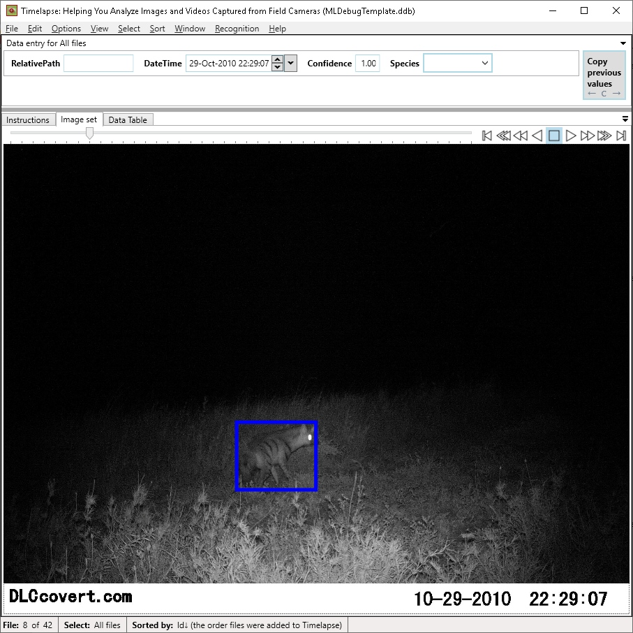

# Integration with Timelapse

[Timelapse](http://saul.cpsc.ucalgary.ca/timelapse/) is an open-source tool for annotating camera trap images.  We have worked with the Timelapse developer to integrate the output of our API into Timelapse, so a user can:

- Select or sort images based on whether they contain people or animals
- View bounding boxes during image annotation (which can speed up review... but mostly just looks pretty, the important part is selection)

## Setting Timelapse up to work with our detector output

This page used to host long and complicated instructions about loading the output of our Camera Trap API into a test version of Timelapse, but now it's all nicely integrated into Timelapse, so instead of listing lots of stuff here, I&rdquo;ll just tell you to:

- Download Timelapse from [here](http://saul.cpsc.ucalgary.ca/timelapse/pmwiki.php?n=Main.Download2)
- Download the Timelapse User Guide [here](http://saul.cpsc.ucalgary.ca/timelapse/pmwiki.php?n=Main.UserGuide), and check out the section called &ldquo;Automatic Image Recognition&rdquo;.  This section has lots of suggestions about efficient workflows.

## Do useful stuff with your ML results!

It's fun and that you can see bounding boxes on top of your animals (we love bounding boxes, and we love animals), but the real goal of this integration is to allow users to:

- Quickly select empty images, review them efficiently and only as necessary, and spend almost no time overall on empty images
- Quickly select images that contain people, review them efficiently and only as necessary, and &ndash; for surveys where people are &ldquo;noise&rdquo; &ndash; spend almost no time overall on images that are people/researchers
- Focus all of your time on images that actually contain animals

