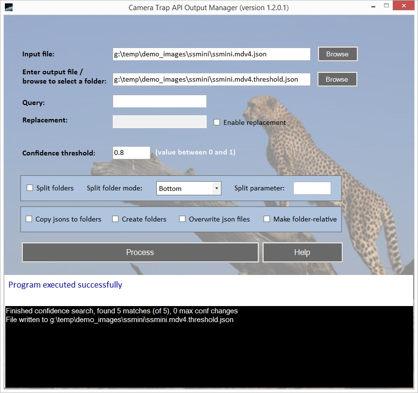

# Camera Trap Batch API Output Manager App

The Camera Trap Batch API Output Manager is a Windows desktop application for making the batch processing API's output JSON file more manageable in downstream processing. It does either or both of the following:

- Retrieves all result entries where the image file path matches a specified query string. It optionally replaces that query string with a replacement token. If the query string is blank, it can be used to prepend a token to all image file paths. A "result entry" corresponds to one image, containing all detections on that image.

- Splits the API's output JSON file into smaller files each containing only results corresponding to a subfolder of images. 
    - This could be useful for distributing the subsequent manual labeling and verification effort, or loading only the relevant results into a [Timelapse](../integration/timelapse.md) project.
    - All images in the subfolder `blah\foo\bar` will end up in a JSON file called `blah_foo_bar.json`.

The app is functionally the same as the Python script [subset_json_detector_output.py](./subset_json_detector_output.py).


## This app is complicated, I just need to remove a folder from all of my image filenames

Indeed, a very common situation is that you ran MegaDetector, and you have an output file in which the image filenames look like this:

`images_for_megadetector/camera_A/image001.jpg`

But in fact, you don't want "images_for_megadetector/" in your filenames.  This is typically because you're using Timelapse, and maybe your Timelapse project is in a folder called:

`c:\camera_trap_stuff`

...and the example image above is on your disk at:

`c:\camera_trap_stuff\camera_A\image001.jpg`

If you open your camera trap results file in that Timelapse project, it will look for a file called:

`c:\camera_trap_stuff\images_for_megadetector\camera_A\image001.jpg`

...which doesn't exist.  You <i>could</i> use this output manager app to fix this, but it's likely quicker to just open your results file in a text editor (notepad, Notepad++, etc.) and replace "images_for_megadetector/" with an empty string.  If your results files are too large to open in your favorite text editor, we recommend <a href="https://www.editpadlite.com/">EditPad Lite</a>, which is (a) free and (b) really good at large text files.

## Download

Download the application <a href="https://lila.science/public/CameraTrapApiOutputManager/CameraTrapApiOutputManager.1.2.0.4.zip">here</a>.


## User guide

The app's interface looks like this:




### Options explained

| Option                   | Explanation                |
|--------------------------|----------------------------|
| Input file               | Path to the batch processing API's output file. It should end in `.json`. |
| Output file / folder     | Specify a file name (ending with `.json`) if you're replacing parts of image file paths in the output file with another token; specify a directory if creating smaller JSON files each with results for a subfolder of images.
| Query                    | Retrieve result entries with image file path containing this query string/token. Leave blank to retrieve all entries. <br/> <br/> Examples:<ul><li>Specify `Unprocessed Images/Camera 3/` to restrict to images from this folder.</li><li>Specify `Location 1` to retrieve all image files that have `Location 1` in their paths.</li><li>If you are processing results from our batch processing API, remember to use forward slashes here, even on Windows.</li></ul>	
| Replacement              | A string/token to replace the Query string in the image file paths. If Query is left blank, the Replacement string will be prepended to all image file paths.  If "Enable replacement" is not checked, this text box is disabled and no replacement will occur.
| Confidence threshold     | Only detections with confidence above this threshold will be included in the output file.  Leave blank for no thresholding.  All other things being equal, leave this blank.  Blank is not the same as zero: if you set this to zero, it will exclude detections with negative confidence values, which can exist in some cases, don't hurt, and can be useful for certain debugging situations.  Ergo, leave blank if you don't want to apply a confidence threshold (which you almost never want to do at this stage).
| Split folders            | Check to split the input JSON file into (smaller) JSON files for individual folders.
| Split folder mode        | Determines how folders get split into JSON files. Only meaningful if "Split folders" is checked. Explained in more detal below. |
| Split parameter          | Used to specify `N` if "Split folder mode" is "NFromTop" or "NFromBottom". Only meaningful if "Split folders" is checked and "Split folder mode" is set to "NFromTop" or "NFromBottom". |
| Copy jsons to folders    | If "Split folders" is checked, copy each resulting small JSON file to the subfolder containing the corresponding images. If "Split folders" is checked but "Copy jsons to folders" is not checked, all the small JSON files will be put in a single directory. All other things being equal, *don't* check this, it can scatter .json files willy-nilly if you're not sure what you're doing. |
| Create folders           | If "Copy jsons to folders" is checked, checking this option will create the subfolder in the image directory if it does not yet exist. | 
| Overwrite json files     | Overwrite output files if they already exist. |
| Make folder-relative     | Make the image file paths in the resulting JSON(s) relative to their containing folder. Only meaningful if "Split folders" is checked. If you are going to split your .json file up into smaller .json files, there's almost no situation where you *don't* want to check this box. |


### "Split folder mode" explained

Let's say the image file paths in your API output look like this:

```
A/B/C/D/image001.jpg
A/B/C/E/image002.jpg
A/B/C/F/image003.jpg
A/B/C/G/image004.jpg
E/Q/R/S/image005.jpg
E/Q/R/T/image006.jpg
```

#### Top

If you set "Split folder mode" to "Top", that means "split image entries into JSON files based on the <i>top</i>-level folder".  In the above example, you would get two JSON files, one for the folder "A", and one for the folder "E".  Those files would be called "A.json" and "E.json", respectively.


#### Bottom

If you set "Split folder mode" to "Bottom", the app would create JSON files for the bottom-level folders.  In the above example, you would get six JSON files, for the folders:

```
A/B/C/D
A/B/C/E
A/B/C/F
A/B/C/G
E/Q/R/S
E/Q/R/T
````
 
Those files would be called:

```
A_B_C_D.json
A_B_C_E.json
A_B_C_F.json
A_B_C_G.json
E_Q_R_S.json
E_Q_R_T.json
````

This is useful if you have one camera’s data in each bottom-most folder.


#### NFromTop

What if you want each JSON file to represent a subfolder that's not a top-most nor a bottom-most folder?

If all of them are a certain number of levels (`N`) below the top-most folder, you can choose the "NFromTop" option and specify `N` in the "Split parameter" text box. `N` is "how many folders _down from the top_". 

When "NFromTop" is specified, setting `N` to "0" would be the same as using the "Top" splitting mode.  Setting `N` to "1" would split one level down from the top, "2" would split two levels down, etc.  

In the above example, setting `N` to 1 and using "NFromTop" results in two JSON files, for the folders:

```
A/B
E/Q
```

#### NFromBottom

Same idea for "NFromBottom", where `N` is "how many folders _up from the bottom_". 

Here using a value of "0" for `N` would be the same as using the "Bottom" splitting mode (bottom-most folders), "1" would be one level up, etc. So in the above example, using "NFromBottom" and setting `N` to 1 would result in JSON files for these folders:

```
A/B/C
E/Q/R
```


### Once you've filled in the options...

Click `Process` to proceed. The output window will show a progress bar and the paths to the resulting, smaller JSON files. 

The `Help` button will bring you to this page.


## Other notes

You should not need to worry about the fact that the output file uses forward slashes `/`, except in specifying the Query and Replacement string/token. Both the Output Manager and Timelapse will handle the path separator correctly for the platform you're running on.


## Help

If you run into any issues, email us at cameratraps@lila.science for help!
