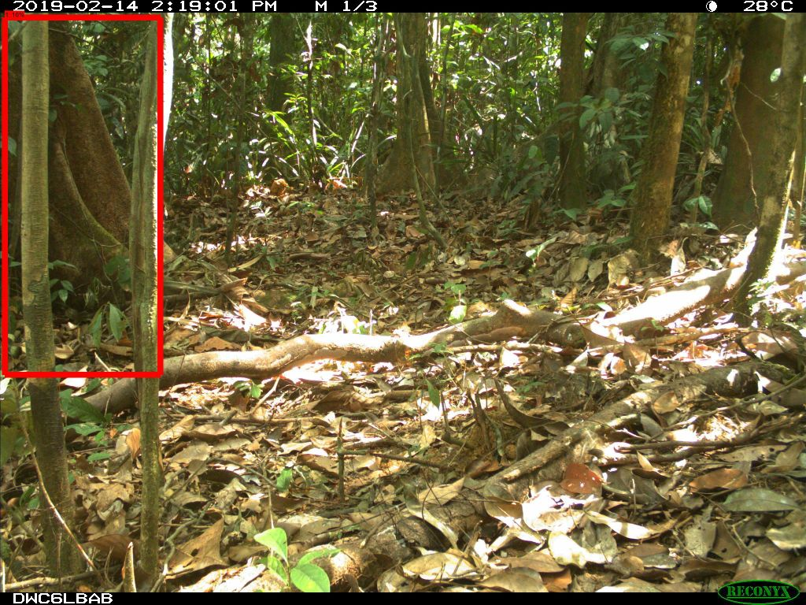
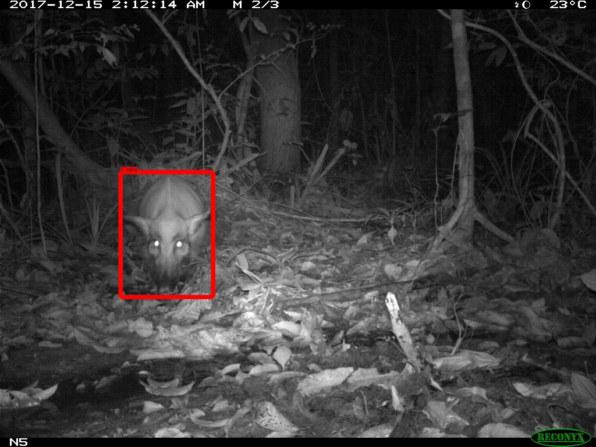
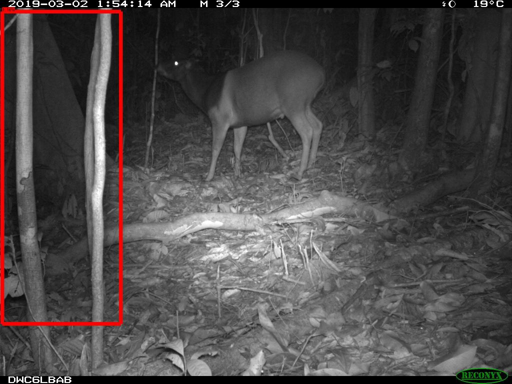
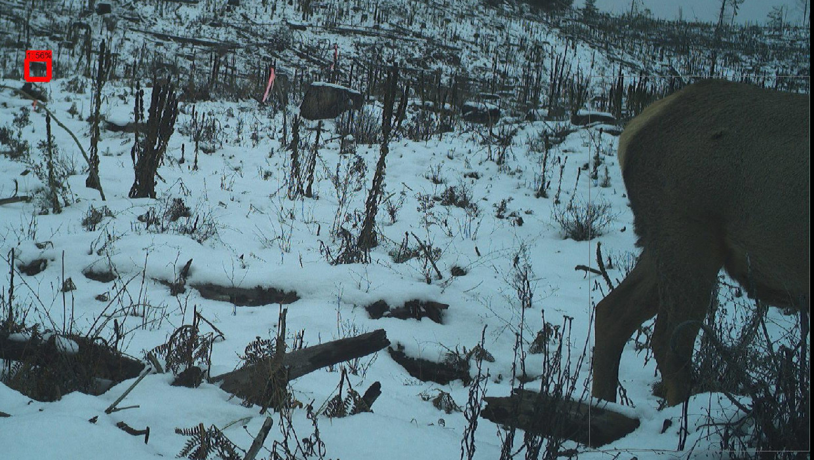
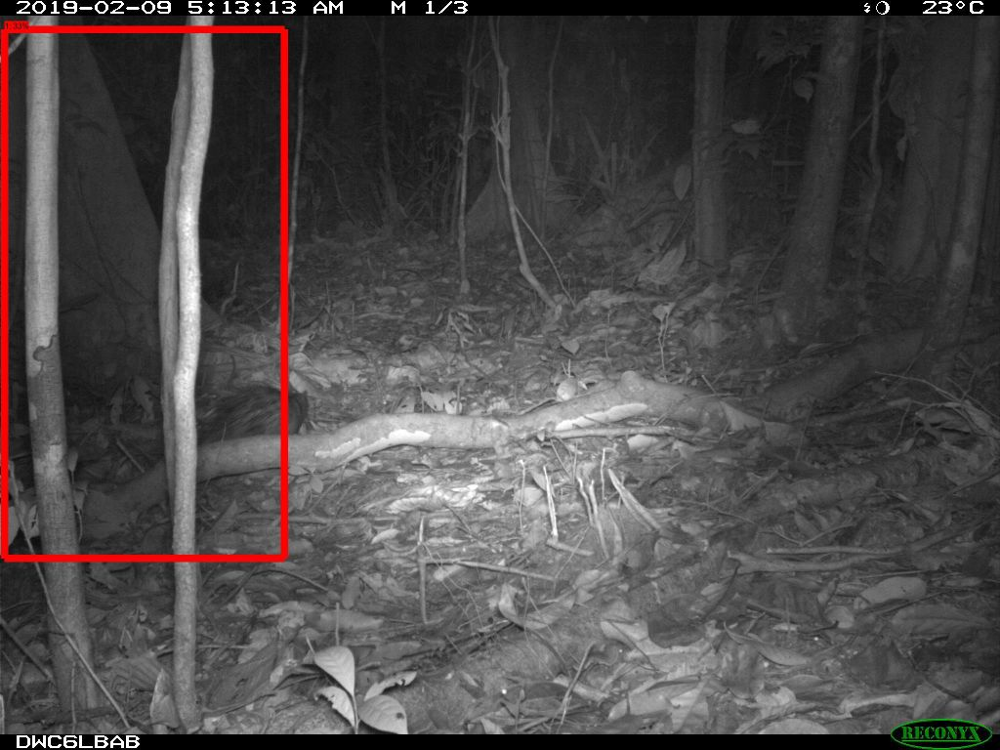

# Overview

We like to think our camera trap detector model is pretty good, but we admit it&rsquo;s not perfect: inevitably, we see some &ldquo;false positives&rdquo;, i.e. pesky branches, piles of snow, or roadside litter that our model thinks is an animal.  As with <i>all</i> object detection models, you can reduce your false positive rate by raising your detection threshold, but if you raise it too high, you risk missing objects you care about.

One of the things we can take advantage of for camera traps, though, is the fact that cameras typically take thousands of images from the same perspective, and if a detector thinks that branch is an animal in one image, it probably identifies the same branch in <i>hundreds</i> of other images.  If <i>exactly the same bounding box</i> is predicted on many images, we call that a <i>suspicious detection</i>.

Suspicious detections aren&rsquo;t always false positives though: sleeping animals can occur in many images without moving an inch, and sometimes cameras on trails frequently have humans entering from the same spot, so we might see thousands of legitimate detections around that spot, and some of them are bound to be about the same size.

Consequently, we have a set of scripts that:

1. Identifies &ldquo;suspicious detections&rdquo;
2. Makes it easy for a human to very efficiently review just a small fraction of those images to see which ones are really false positives
3. Removes the false positives from a result set

This whole process can eliminate tens of thousands of false detections with just a few minutes of human annotation.

This document shows you how to run these scripts.

<b>None of this is required</b>; you can work with our API output without doing this step.  It takes a file in our API format and produces a file in the same format (with fewer false positives, hopefully), so for many situations you might decide to skip this step entirely.


# Prerequisites

The suspicious detection elimination process assumes the following:

1. You have Python installed.  If you&rsquo;re working on Windows, we recommend installing <a href="anaconda.com/distribution/">Anaconda</a>, which is Python plus a zillion useful packages.
2. You have checked out this git repo, and the <a href="http://github.com/microsoft/ai4eutils">AI for Earth Utilities</a> repo.  If you&rsquo;re not familiar with git, we recommend installing <a href="https://git-scm.com/download/win">Git for Windows</a>.  Specific instructions for checking out the repo will be rolled into the next step.
3. You have put the base folder of both repos on your Python path.  If you are using Windows, for example, you would do this by finding the directory to which you cloned each repo, and adding that directory to your PYTHONPATH environment variable.  Here&rsquo;s a <a href="https://www.computerhope.com/issues/ch000549.htm">good page</a> about editing environment variables in Windows.  You will need administrative access to your PC to set an environment variable.

Here are instructions for steps 2 and 3 that assume you <i>don&rsquo;t</i> have administrative access to your PC (if you set the environment variable as per above, you can skip the &ldquo;set PYTHONPATH&rdquo; step here).  We&rsquo;re going to put things in &ldquo;c:\git&rdquo;, but you can use any folder you like. 

After installing git and Anaconda, open an Anaconda Prompt, and run:

```mkdir c:\git
cd c:\git
git clone https://github.com/ecologize/CameraTraps
git clone https://github.com/Microsoft/ai4eutils
pip install jsonpickle humanfriendly
cd c:\git\cameratraps
set PYTHONPATH=c:\git\cameratraps;c:\git\ai4eutils
python api\batch_processing\postprocessing\repeat_detection_elimination\find_repeat_detections.py
```

Subsequent times you open your Anaconda prompt, you'll just need to do:

```cd c:\git\cameratraps\api\batch_processing\postprocessing
set PYTHONPATH=c:\git\cameratraps;c:\git\ai4eutils
python find_repeat_detections.py
```

4. You have run our our <a href="https://github.com/ecologize/CameraTraps/tree/master/api/batch_processing">batch processing API</a> on our images, and have the .json file it produced for your images.
5. Your images are organized such that the lowest-level folder is a camera.  For example, if you have images in `c:\my_images\2019\B1`, everything in `B1` comes from the same caemra.  This matters because we won&rsquo;t even compare images in this folder to images in `c:\my_images\2019\A1`.  If your images are arranged differently, but there&rsquo;s still some easy way to identify which images are from the same camera, <a href="mailto:cameratraps@lila.science">contact us</a>.


# Finding suspicious detections

The first step is to find all the detections that are suspicious, i.e. cases where the same detection is repeated a bunch of times.  For this step, you will use the script:

`(camera trap repo base)/api/batch_processing/postprocessing/find_repeat_detections.py`

This script is going to generate a bunch of temporary images that you will look at to quickly identify which are actually false positives.

So let&rsquo;s assume that:

* Your .json results file is in `c:\my_results.json`
* You want all the temporary images to end up under `c:\repeat_detection_stuff`
* Your original images are in `c:\my_images`

You would run:

`python find_repeat_detections.py "c:\my_results.json" --imageBase "c:\my_images" --outputBase "c:\repeat_detection_stuff"`

This script can take a while!  Possibly hours if you have millions of images.  If you want to test it on just a couple folders first, you can use the `debugMaxDir` option, to tell the script to only process a certain number of cameras.  E.g.:

`python find_repeat_detections.py [...all the other stuff...] --debugMaxDir 10`

There are lots of other options to this script; we&rsquo;ll talk about them later.  They all relate to the things you can do to make the basic process even more efficient by controlling what gets identified as &ldquo;suspicious&rdquo;.


# Cleaning up the suspicious detections that were, in fact, real objects

When the script finishes, you&rsquo;ll have a directory called something like `filtering_2019.10.24.13.40.45` inside the main directory you specified above.  For example, using our running example: 

`c:\repeat_detection_stuff\filtering_2019.10.24.13.40.45`

This directory will have lots of pictures with bounding boxes on them.  Importantly, you are not looking at <i>every</i> detection; each one of these images represents potentially very many nearly-identical detections.  Even though you&rsquo;re doing some manual work here, machine learning is saving you lots of time!

Most of these images indeed correspond to repeated false positives:

&nbsp;&nbsp;&nbsp;&nbsp;&nbsp;&nbsp;<br/>

<b>You don&rsquo;t need to delete the above image; just leave it in the folder.</b>

But some are just animals that aren&rsquo;t moving much:

&nbsp;&nbsp;&nbsp;&nbsp;&nbsp;&nbsp;<br/>

<b>You should delete the above image.</b>

Anything left in this folder will be considered a false positive and removed from your results in subsequent steps, so the next task is to <i>delete all the images in this folder that have bounding boxes on actual objects of interest: animals, people, or vehicles</i>.

Note that it&rsquo;s common to have a false positive in an image that also has an animal in it; you can safely leave these in the folder (telling the scripts that this is indeed a false positive), because these scripts operate on individual <i>detections</i>, not <i>images</i>.  So the following image is safe to leave in place, and you&rsquo;ll be telling the script that the box is a false positive, but you <i>won&rsquo;t</i> be telling it that the deer is a false positive:

&nbsp;&nbsp;&nbsp;&nbsp;&nbsp;&nbsp;<br/>

<b>You don&rsquo;t need to delete the above image; just leave it in the folder.</b>

Sometimes it's actually distracting when an obvious animal like the one in the above image <i>doesn't</i> have a box around it; even though it shouldn't have a box on it here, it can feel like MegaDetector is missing things.  So, depending on the options you choose, you can have very light gray boxes put around detections <i>other</i> than the one we're actually evaluating, just to give us some comfort that the animal was found, like so:

&nbsp;&nbsp;&nbsp;&nbsp;&nbsp;&nbsp;<br/>

You may not even be able to see the gray box if you're viewing this on GitHub, but if you open the image in a new tab, you'll see a thin gray line around the elk.  The thick red box is the one we're interested in, so the elk doesn't matter here.

<b>You don&rsquo;t need to delete the above image; just leave it in the folder.</b>

Every once in a while you'll see a box that&rsquo;s <i>partially</i> on an animal.  This is <i>probably</i> a false positive that happened to also include an animal, but if it&rsquo;s a close call, the conservative thing to do is always to delete this image, rather than leaving it in the folder.  This will tell the next set of scripts that this box was a real animal. Example:

&nbsp;&nbsp;&nbsp;&nbsp;&nbsp;&nbsp;<br/>

<b>This is a gray area, but the conservative thing to do is to delete this image.</b>

You can do this step (deleting images) using any tool you like, but for the author&rsquo;s two cents, I really like having two windows open:

1. The regular Windows explorer with &ldquo;view&rdquo; set to &ldquo;extra large icons&rdquo;.
2. <a href="https://www.irfanview.com">IrfanView</a>, which is a simple, fast image viewer that makes it very quick to page through lots and lots of images in a row that are all just branches and leaves (by pressing or holding down the &ldquo;right&rdquo; key), and you can just press the &ldquo;delete&rdquo; key in IrfanView to delete an image when you see an animal/person.  This makes things very fast!  I recommend literally having one hand on &ldquo;page down&rdquo; and the other on &ldquo;delete&rdquo;.

Pro tip: this directory (starting with &ldquo;filtering&rdquo;) is entirely self-contained, so you can zip it up and take it to a different computer to do the actual deletion.  This is useful, for example, if you&rsquo;re working on a remote machine but you want the super-duper-low-latency experience of working on your local machine for the actual image deletion.  When you&rsquo;re done, you can just zip up the folder (now smaller, because you deleted a bunch of images) and ship it back to the other machine.

Remember that in the next step, we&rsquo;ll be marking any detections left in this folder as false positives, so you probably won&rsquo;t see any of these images again.  <b>So make sure to delete all the images that have boxes on stuff you care about!</b>


# Producing the final &ldquo;filtered&rdquo; output file

When that directory contains only false positives, you&rsquo;re ready to remove those - and the many many images of the same detections that you never had to look at - from your results.  To do this, you&rsquo;ll use this script:

`(camera trap repo base)/api/batch_processing/postprocessing/remove_repeat_detections.py`

The syntax is:

`python remove_repeat_detections.py [inputFile] [outputFile] [filteringFolder]`

So specifically, in our running example, to take the original `my_results.json` file and produce a new `my_results_filtered.json` file with the repeat detections removed, you would run:

`python remove_repeat_detections.py "c:\my_results.json" "c:\my_results_filtered.json" "c:\repeat_detection_stuff\filtering_something_something"`

The &ldquo;something_something&rdquo; part at the end refers to the exact folder name, which includes some date and time information, so this might actually look like:

`python remove_repeat_detections.py "c:\my_results.json" "c:\my_results_filtered.json" "c:\repeat_detection_stuff\filtering_2019.10.24.16.52.54"`

This script takes your original .json file and removes detections corresponding to the stuff you left in the folder in the previous step.  Actually, it doesn&rsquo;t technically remove them; rather, it sets their probabilities to be negative numbers.  So it&rsquo;s possible in downstream processing tools to figure out which things were &ldquo;removed&rdquo; by this process.

This script is also slow: for historical reasons, it *re-finds* all the suspicious detections, then removes the ones that were left in the directory.  We hope to fix this soon.


# What next?

After running this process, you still have a .json file in the same format that our API produces, just with (hopefully) many fewer false positives that are above your confidence threshold.  At this point, you can proceed with whatever workflow you would normally use to work with our API output, e.g. our <a href="https://github.com/ecologize/CameraTraps/blob/master/api/batch_processing/integration/timelapse.md">integration with Timelapse</a>.


# Advanced options

There are a few magic numbers involved in identifying &ldquo;suspicious&rdquo; detections.  You can tune these to identify more or fewer detections as suspicious, depending on how it&rsquo;s performing on your data and how much time you want to spend reviewing.

You can run:

`python find_repeat_detections.py`

...for a full list of options and documentation for each, but some specific options of interest:

* `--confidenceMax` is a way of telling the script not to consider anything that&rsquo;s very high confidence as suspicious.  This defaults to 1.0, meaning even a box with confidence 0.99999 could be treated as suspicious.
* `--confidenceMin` is a way of not wasting time on things you were going to throw out anyway, by telling the scripts not to even consider low-confidence detections as suspicious.
* `--iouThreshold` controls exactly how similar two boxes have to be in order to be considered &ldquo;identical&rdquo;.  If you show any detector nearly identical images with just a couple pixels of difference between them, the resulting bounding boxes may move around a bit.  A value of 1.0 (which you shouldn&rsquo;t use) says that two boxes have to be <i>identical</i> to be considered repeats.  Lowering this value will collapse more detections into a single example detection, but if you lower this too far, anything can be considered identical, and you&rsquo;ll start treating totally separate detections as identical.
* `--occurrenceThreshold` controls how many times a detection needs to be seen to be considered suspicious.
* `--maxSuspiciousDetectionSize` puts a limit on how large a suspicious box can be: sometimes animals take up the whole image, and by definition you get the same box for every animal that takes up the whole image.
