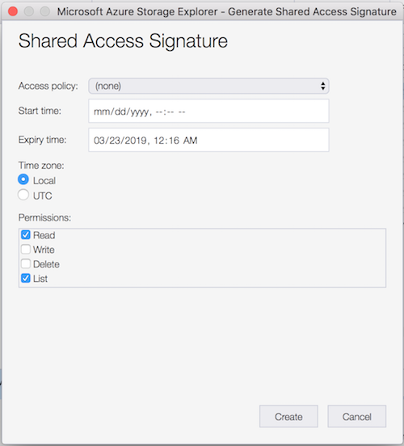
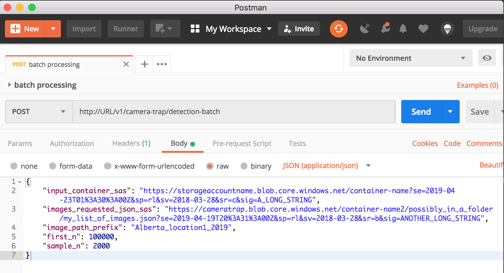

# Detector batch processing API user guide

We offer a service for processing a large quantity of camera trap images using our [MegaDetector](https://github.com/Microsoft/CameraTraps#megadetector) by calling an API, documented here. You can process a batch of up to 2 million images in one request to the API. If in addition you have some images that are labeled, we can evaluate the performance of the MegaDetector on your labeled images (not documented here).

All references to "container" in this document refer to [Azure Blob Storage](https://azure.microsoft.com/en-us/services/storage/blobs/) containers. 

## Processing time
It takes about 0.8 seconds per image per machine, and we have at most 16 machines that can process them in parallel. So if no one else is using the service and you'd like to process 1 million images, it will take 1,000,000 * 0.8 / (16 * 60 * 60) = 14 hours. 

The API is still in testing, so we might have to give it a couple of tries - please contact us if you run into issues before retrying to make sure abandoned jobs are not using up resources.


## API

### Endpoints

The endpoints of this API are available at

```
http://URL/v1/camera-trap/detection-batch
```

#### `/request_detections`
To submit a request for batch processing, make a POST call to

```http://URL/v1/camera-trap/detection-batch/request_detections```.

with a json body containing input fields defined below. The API will return with a json response very quickly to give you a RequestID representing the request you have submitted (or an error message, if your inputs are not acceptable), for example:
```json
{
  "request_id": "134329085438975"
}
```


#### `/task`
Check the status of your request by calling the `/task` endpoint via a GET call, passing in your RequestID:

```http://URL/v1/camera-trap/detection-batch/task/RequestID```

This returns a json with the field `status`, which starts with `running`, `failed`, `almost completed`, or `completed`, followed by a description of the request's status, an error message, or a stringfied json object with URLs to the 3 output files. 


#### `/model_version`
Check the detector model's version by making a GET call to

```http://URL/v1/camera-trap/detection-batch/model_version```

to see a string that identifies the model used.


#### Canceling a request
Not yet supported. Meanwhile, once the shards of images are submitted for processing (status "running - all x images submitted to cluster for processing." has appeared), please do not retry if a subsequent call to the `\task` endpoint indicates that there has been an error. Instead, contact us to retrieve any results (the error message will mention "please contact us" in that case).


### Inputs

| Parameter                | Is required | Explanation                                                                                                                          |
|--------------------------|-------------|-------------------------------------------------------------------------------------------------------------------------------|
| input_container_sas      | Yes         | SAS URL with list and read permissions to the Blob Storage container where the images are stored.                             |
| images_required_json_sas | No          | SAS URL with list and read permissions to a json file in Blob Storage. The json contains a list, where each item (a string) in the list is the full path to an image from the root of the container. An example of the content of this file: `["Season1/Location1/Camera1/image1.jpg", "Season1/Location1/Camera1/image2.jpg"]`.  Only images whose paths are listed here will be processed. |
| image_path_prefix        | No          | Only process images whose full path starts with `image_path_prefix`. Note that any image paths specified in `images_required_json_sas` will need to be the full path from the root of the container, regardless of `image_path_prefix`. |
| first_n                  | No          | Only process the first `first_n` images. Order of images is not guaranteed, but is likely to be alphabetical. Set this to a small number to avoid taking time to fully list all images in the blob (about 15 minutes for 1 million images) if you just want to try this API. |
| sample_n                 | No          | Randomly sample `sample_n` images to process. |


- We assume that all images you would like to process in this batch are uploaded to a container in Azure Blob Storage. 
- Only images with file name ending in '.jpg' or '.jpeg' (case insensitive) will be processed, so please make sure the file names are compliant before you upload them to the container (you cannot rename a blob without copying it entirely once it is in Blob Storage). 

- By default we process all such images in the specified container. You can choose to only process a subset of them by specifying the other input parameters, and the images will be filtered out accordingly in this order:
    - `images_requested_json_sas`
    - `image_path_prefix`
    - `first_n`
    - `sample_n`  (not yet implemented)
    
    - For example, if you specified both `images_requested_json_sas` and `first_n`, only images that are in your provided list at `images_requested_json_sas` will be considered, and then we process the `first_n` of those.

Example body of the POST request:
```json
{
  "input_container_sas": "https://storageaccountname.blob.core.windows.net/container-name?se=2019-04-23T01%3A30%3A00Z&sp=rl&sv=2018-03-28&sr=c&sig=A_LONG_STRING",
  "images_requested_json_sas": "https://cameratrap.blob.core.windows.net/container-name2/possibly_in_a_folder/my_list_of_images.json?se=2019-04-19T20%3A31%3A00Z&sp=rl&sv=2018-03-28&sr=b&sig=ANOTHER_LONG_STRING",
  "image_path_prefix": "Alberta_location1_2019/",
  "first_n": 100000,
  "sample_n": 2000
}
```

You can manually call the API using applications such as Postman:




#### How to obtain a SAS token
You can easily generate a [SAS token](https://docs.microsoft.com/en-us/azure/storage/common/storage-dotnet-shared-access-signature-part-1) to a container or a particular blob (a file in blob storage) using the desktop app [Azure Storage Explorer](https://azure.microsoft.com/en-us/features/storage-explorer/) (available on Windows, macOS and Linux). You can also issue SAS tokens programmatically by using the [Azure Storage SDK for Python](https://azure-storage.readthedocs.io/ref/azure.storage.blob.baseblobservice.html#azure.storage.blob.baseblobservice.BaseBlobService.generate_blob_shared_access_signature).


Using Storage Explorer, right click on the container or blob you'd like to grant access for, and choose "Get Shared Access Signature...". On the dialogue window that appears, 
- cross out the "Start time" field if you will be using the SAS token right away
- set the "Expiry time" to a date in the future, about a month ahead is reasonable. The SAS token needs to be valid for the duration of this the batch processing request. 
- make sure "Read" and "List" are checked under "Permissions" (see screenshot) 

Click "Create", and the "URL" field on the next screen is the value required for `input_container_sas` or `images_requested_json_sas`. 




### Outputs

Once your request is submitted and parameters validated, the API divides all images into shards of about 2000 images each, and send them to an Azure Machine Learning compute cluster for processing. Another process will monitor how many shards have been evaluated, checking every 30 minutes, and update the status of the request, which you can check via the `\task` endpoint. 

When all shards have finished processing, the status at `\task` will contain a string that can be loaded as a json, with 3 fields each containing an URL to a downloadable file. The string looks like

```
"completed - timestamp 2019-03-25 01:00:13.990985. Number of failed shards: 0. URLs to output files: {\"detections\": \"https://cameratrap.blob.core.windows.net/async-api-v2/RequestID/RequestID_detections.csv?se=2019-04-08T01%3A00%3A13Z&sp=r&sv=2018-03-28&sr=b&sig=LONG_STRING_1\", \"failed_images\": \"https://cameratrap.blob.core.windows.net/async-api-v2/6171/RequestID_failed_images.csv?se=2019-04-08T01%3A00%3A13Z&sp=r&sv=2018-03-28&sr=b&sig=LONG_STRING_2\", \"images\": \"https://cameratrap.blob.core.windows.net/async-api-v2/RequestID/RequestID_images.json?se=2019-04-08T01%3A00%3A13Z&sp=r&sv=2018-03-28&sr=b&sig=LONG_STRING_3\"}"
```
 which you can parse to obtain the URLs:
```python
import json

output_files_str = body['status'].split('URLs to output files: ')[1]
output_files = json.loads(output_files_str)
url_to_result = output_files['detections']
```

These URLs are valid for 14 days from the time the request has finished. If you neglected to retrieve them before the links expired, contact us with the RequestID and we can send the results to you. Here are the 3 files to expect:

| File name                | Description | 
|--------------------------|-------------|
| RequestID_detections.csv | Contains the result produced by the detector. It is a table with 3 columns (see below for explanation).   |
| RequestID_failed_images.csv | Contains full paths to images in the blob that the API failed to open, possibly because they are corrupted, or failed to apply the detector model to. |
| RequestID_images.json | Contains a list of the full paths to all images that the API was supposed to process, based on the content of the container at the time the API was called and the filtering parameters provided. |


#### How to interpret the results

The output of the detector is saved in `RequestID_detections.csv`. It looks like

| image_path | max_confidence | detections | 
|------------|----------------|------------|
| folder/subfolders/image1.JPG | 0.9960 | "[[0.5252, 0.1727, 0.9546, 0.43948, 0.9960], [0.8804, 0.4575, 0.94537, 0.5313, 0.1468]]" |
| folder/subfolders/image2.JPG | 0.0 | [] |
| folder/subfolders/image3.jpg | 0.0 | [] |
| folder/subfolders/image4.jpg | 0.4091 | "[[0.2823, 0.1759, 0.3608, 0.2458, 0.4091]]" |

The first column contains the full path to the image in the blob container. 

The second column is the confidence value of the most confident detection on the image (all detections above confidence 0.05 are included so you can select a confidence threshold for determining empty from non-empty).

The third column contains details of the detections so you can visualize them. It is a stringfied json of a list of lists, representing the detections made on that image. Each detection list has the coordinates of the bounding box surrounding the detection, followed by its confidence:

```
[ymin, xmin, ymax, xmax, confidence]
```

where `(xmin, ymin)` is the upper-left corner of the detection bounding box. The coordinates are relative to the height and width of the image. 

When the detector model detects no animal, the confidence is shown as 0.0 (not confident that there is an animal) and the detection column is an empty list.


