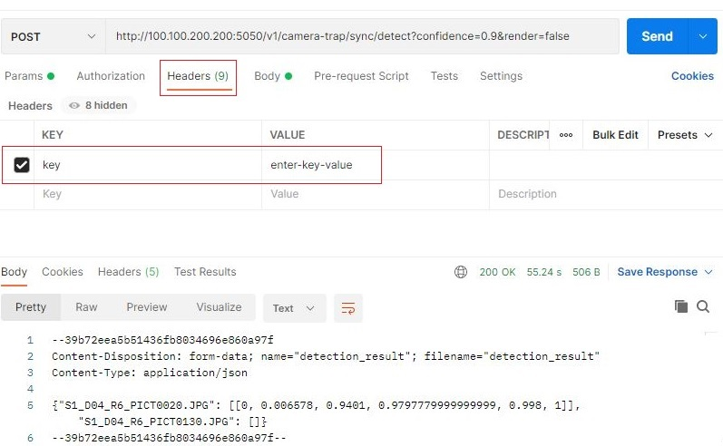
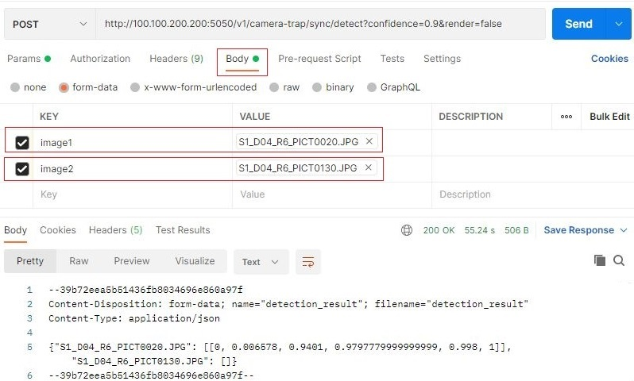

# Camera trap real-time flask-redis API

## Sample notebook

This README documents the configuration of the MegaDetector API; a notebook that demonstrates the *calling* of the API is available [here](camera_trap_flask_api_test.ipynb).

## Setup

### Prerequisites

The most notable prerequisite is nvidia-docker; install according to:

<https://docs.nvidia.com/datacenter/cloud-native/container-toolkit/install-guide.html>


### Set up the repo

- Clone the camera traps repo

    ```bash
    git clone "https://github.com/microsoft/CameraTraps/"
    cd CameraTraps
    ```
    
- During this testing phase, switch to the api-flask-redis-v1 branch

    ```bash
    git checkout api-flask-redis-v1
    ````


### Download the model file

- Download the MegaDetector model file to `api_flask_redis/api_core/animal_detection_api/model`

    ```bash
    wget "https://lilablobssc.blob.core.windows.net/models/camera_traps/megadetector/md_v4.1.0/md_v4.1.0.pb" -O api_flask_redis/api_core/animal_detection_api/model/md_v4.1.0.pb
    ```

### Enable API key authentication (optional)

- To authenticate the API via a key, create a file with name `allowed_keys.txt`, add it to the folder `api_flask_redis/api_core/animal_detection_api`, then add a list of keys to the file, with one key per line.
 
 
### Build the Docker image

- Switch to the `api_flask_redis/api_core` folder, from which the Docker image expects to be built

    ```bash
    cd api_flask_redis/api_core
    ```

- Name the API's Docker image (the name doesn't matter, this is just a convenience if you are experimenting with multiple versions)

    ```bash
    export API_DOCKER_IMAGE=camera-trap-api:1.0
    ```

- Set the base TensorFlow image

    For GPU environments:

    ```bash
    export BASE_IMAGE=tensorflow/tensorflow:1.14.0-gpu-py3
    ```
    
    Nota bene: we have historically run MegaDetector v4 in a TF 1.1x environment (since that's how it was trained), but TF 1.1x is incompatible with some newer GPUs, and you may find that things hang after loading CuDNN.  If you experience that, try a TF2 environment instead:
    
    ```bash
    export BASE_IMAGE=tensorflow/tensorflow:latest-gpu
    ```
    
    For non-GPU environments:
    
    ```bash
    export BASE_IMAGE=tensorflow/tensorflow:1.14.0-py3
    ```

### Build the Docker image

```bash
sudo sh build_docker.sh $BASE_IMAGE $API_DOCKER_IMAGE
```

### Run the Docker image

The following will run the API locally on port 5050.

- For GPU environments:

    ```bash
    sudo nvidia-docker run -it -p 5050:1212 $API_DOCKER_IMAGE
    ```

- For non-GPU environments:

    ```bash
    sudo docker run -it -p 5050:1212 $API_DOCKER_IMAGE
    ```

## Test the API in Postman

- To test in Postman, in a Postman tab enter the URL of the API, e.g.:

  `http://100.100.200.200:5050/v1/camera-trap/sync/detect`
  
 - Select `POST`
 - Optionally add the `min_confidence` parameter, which sets the minimum detection confidence that's returned to the caller (defaults to 0.1)
 - Optionally add the `min_rendering_confidence` parameter, which sets the minimum detection confidence that's rendered to returned images (defaults to 0.8) (not meaningful if "render" is False)
 - Optionally add the `render` parameter, set to `true` if you would like the images to be rendered with bounding boxes
 - If you enabled authentication by adding the file `allowed_keys.txt` under `api_flask_redis/api_core/animal_detection_api`then in the headers tab add the `key` parameter and enter the key value (this would be one of the keys that you saved to the file `allowed_keys.txt`)
 - Under `Body` select `form-data`, create one key/value pair per image, with values of type "file" (to upload an image file)
 - Click `Send`

 

<br/>



<br/>



<br/>
