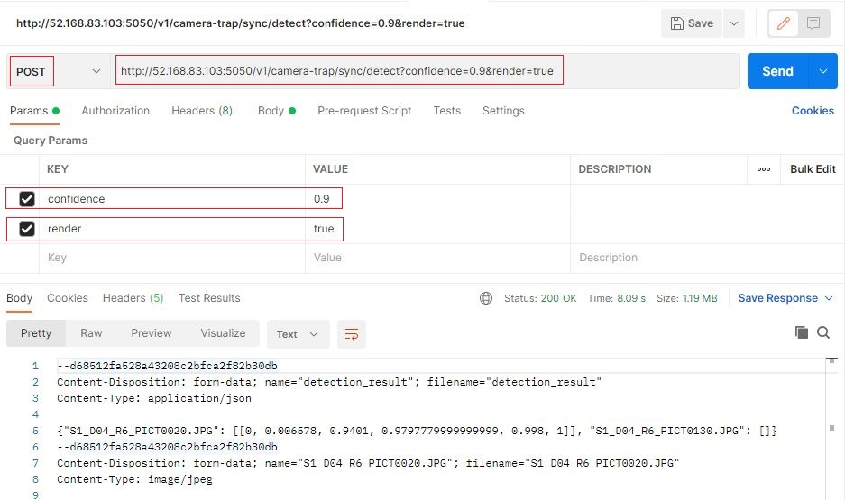
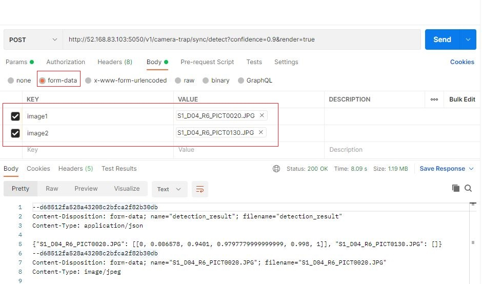

# Camera trap real-time flask-redis API

## Setup

### Prerequisites

The most notable prerequisite is nvidia-docker; install according to:

<https://docs.nvidia.com/datacenter/cloud-native/container-toolkit/install-guide.html>


### Set up the repo

- Clone the camera traps repo:

```bash
git clone "https://github.com/microsoft/CameraTraps/"
cd CameraTraps
```

- During this testing phase, switch to the api-flask-redis-v1 branch:

```bash
git checkout api-flask-redis-v1
````


### Prepare the model files

Download the MegaDetector model file to `api_flask_redis/api_core/animal_detection_api/model`:

```bash
wget "https://lilablobssc.blob.core.windows.net/models/camera_traps/megadetector/md_v4.1.0/md_v4.1.0.pb" -O api_flask_redis/api_core/animal_detection_api/model/md_v4.1.0.pb
```

### Build the Docker image

- Switch to the `api_flask_redis/api_core` folder, from which the Docker image expects to be built:

```bash
cd api_flask_redis/api_core
```

- Name the API's Docker image; modify its version and build number as needed:
```bash
export API_DOCKER_IMAGE=camera-trap-api:1.0
```

- Build the Docker image:

```bash
sudo docker build . -t $API_DOCKER_IMAGE
```

### Run the Docker image

- Start the Docker container to host the API locally at port 5050 of the VM:

```bash
sudo nvidia-docker run -p 5050:1212 $API_DOCKER_IMAGE
```

## Test the API in Postman

- To test in Postman, in a Postman tab enter the URL of the API, e.g.:

  `http://52.168.83.103:5050/v1/camera-trap/sync/detect'
  
  ?confidence=0.8&render=false`

 - Select `POST`
 - Add the `confidence` parameter, and provide a value for confidence level
 - Optionally add the `render` parameter, set to `true` if you would like the images to be rendered with bounding boxes
 - Under `Body` select `form-data`, create one key/value pair per image, with values of type "file" (to upload an image file)
 - Click `Send`





