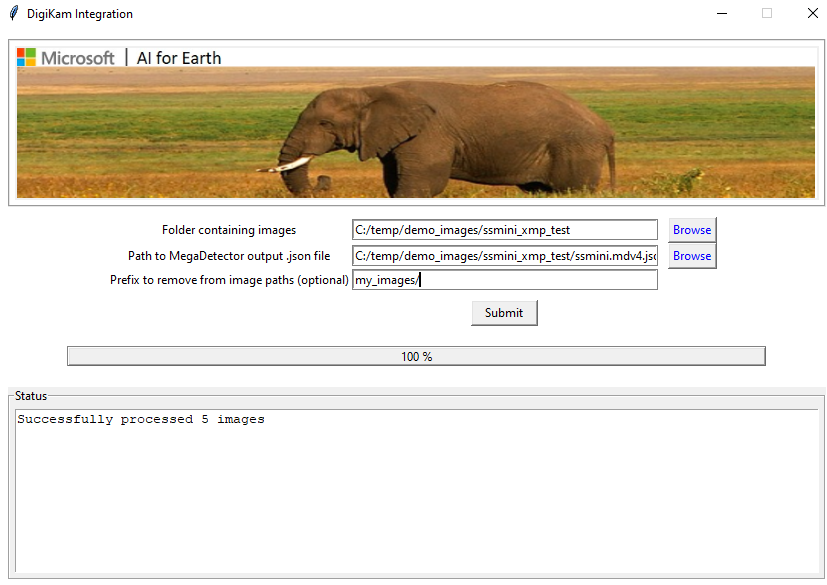
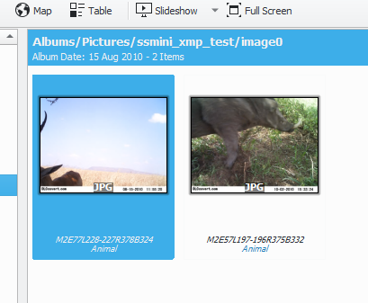

# MegaDetector integration with digiKam

This folder contains a Python tool to transfer annotations produced by MegaDetector to the hierarchicalSubject field of XMP data in JPG images, to support the ingestion and review of those results in <a href="https://www.digikam.org/">digiKam</a>.

The tool can be run from the command line or as a GUI-based application.

## Running the command-line tool

Run the script as:

`python xmp_integration.py --input_file [input_file] --image_folder [image_folder] --path_to_remove [path_to_remove]`

* `input_file` is the .json file produced by the MegaDetector batch API or by run_tf_detector_batch.py
* `image_folder` is the root folder where your images are

`path_to_remove` (optional) is a string that should be removed from the head of all the image paths in the .json file.  For example, let's say you ran MegaDetector on paths that looked like:

`images_for_megadetector/camera1/image01.jpg`

...but now your images look like:

`c:\my_images\camera1\image01.jpg`

In this case, you would want to specify `images_for_megadetector/` for `path_to_remove` and `c:\my_images` for `image_folder`.

## Running the GUI-based tool

Run the script as:

`python xmp_integration.py --gui`

* Select the folder that contains the image
* Select the .json file from the MegaDetector API
* Optional specify a leading string to remove from image paths (see above)
* Click "Submit"

## Validating the XMP data in digiKam

* Open <a href="https://www.digikam.org/">digiKam</a>
* Load the images folder into the album
* Click on an image to view the XMP metadata
* Click on the `Metadata` tab and then the `XMP` tab in the right-side panel
* You should see the `hierarchicalSubject` field in `XMP metadata`, populated with your MegaDetector outputs

## Compiling to an .exe

If you want to compile the tool to an executable (e.g. to make it easier to distribute within your organization), run:

`python setup.py build`

This will create a `build/exe.win-amd64-3.7`, in which you'll find `xmp_integration.exe`.

