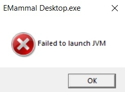

# Troubleshooting eMammal app installation errors

If you get the following error during installation:

...try the following:

1. If the JDK is not installed in the computer, install the latest JDK version (be sure to install it as administrator).

2. If JDK is already installed, uninstall and reinstall the JDK (be sure to install it as administrator).

3. After JDK is installed, make sure that the JDK path is include in the system path.  [This tutorial](https://javatutorial.net/set-java-home-windows-10) shows how to add the JDK path
   to the system path in Windows 10.
   
4. If you have MySQL server installed on your machine, uninstall MySQL server or turn off the MySQL service. To turn off MySQL server, open
   the services.msc app in Windows, find the MySQL service, right-click on the service, and click "stop".

