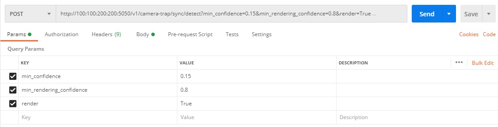
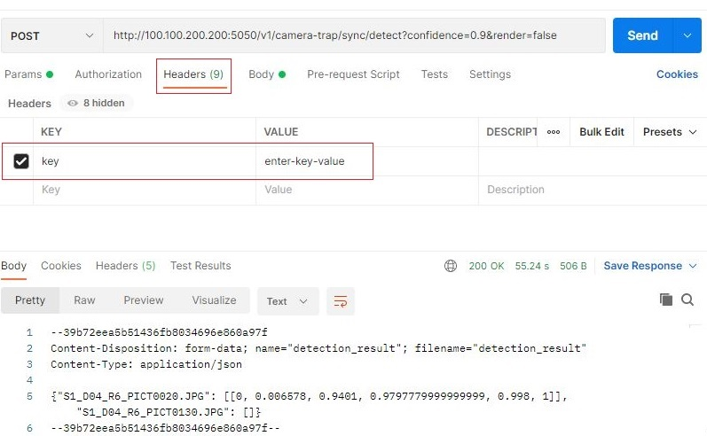
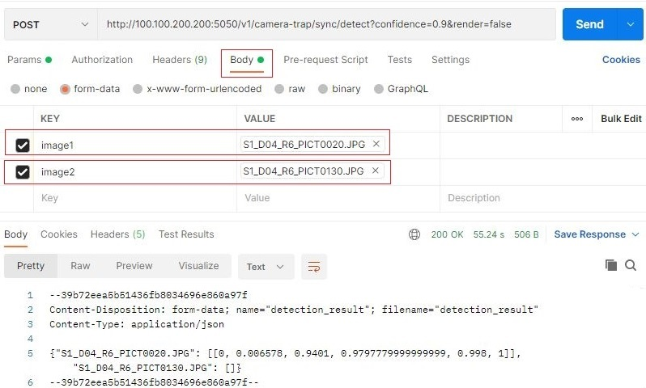

# Announcement

At the core of our mission is the desire to create a harmonious space where conservation scientists from all over the globe can unite, share, and grow. We are expanding the CameraTraps repo to introduce **Pytorch-Wildlife**, a Collaborative Deep Learning Framework for Conservation, where researchers can come together to share and use datasets and deep learning architectures for wildlife conservation.
 
We've been inspired by the potential and capabilities of Megadetector, and we deeply value its contributions to the community. **As we forge ahead with Pytorch-Wildlife, under which Megadetector now resides, please know that we remain committed to supporting, maintaining, and developing Megadetector, ensuring its continued relevance, expansion, and utility.**

To use the newest version of MegaDetector with all the exisitng functionatlities, you can use our newly developed [user interface](#explore-pytorch-wildlife-and-megadetector-with-our-user-interface) or simply load the model with **Pytorch-Wildlife** and the weights will be automatically downloaded:

```python
from PytorchWildlife.models import detection as pw_detection
detection_model = pw_detection.MegaDetectorV5()
```

If you'd like to learn more about **Pytorch-Wildlife**, please continue reading.

For those interested in accessing the previous MegaDetector repository, which utilizes the same `MegaDetector v5` model weights and was primarily developed by Dan Morris during his time at Microsoft, please visit the [archive](./archive) directory, or you can visit this [forked repository](https://github.com/agentmorris/MegaDetector/tree/main) that Dan Morris is actively maintaining.
 
**If you have any questions regarding MegaDetector and Pytorch-Wildlife, please <a href="mailto:zhongqimiao@microsoft.com">email us</a>!**

# Camera trap real-time flask-redis API

## Sample notebook

This README documents the configuration of the MegaDetector API; a notebook that demonstrates the *calling* of the API is available [here](camera_trap_flask_api_test.ipynb).

## Setup

### Prerequisites

The most notable prerequisite is nvidia-docker; install according to:

<https://docs.nvidia.com/datacenter/cloud-native/container-toolkit/install-guide.html>


### Clone this repo

```bash
git clone "https://github.com/ecologize/CameraTraps/"
cd CameraTraps
```

    
### Download the model file

Download the MegaDetector model file(s) to `api/synchronous/api_core/animal_detection_api/model`.  We will download both MDv5a and MDv5b here, though currently the API is hard-coded to use MDv5a.

```bash
wget "https://github.com/ecologize/CameraTraps/releases/download/v5.0/md_v5a.0.0.pt" -O api/synchronous/api_core/animal_detection_api/model/md_v5a.0.0.pt
wget "https://github.com/ecologize/CameraTraps/releases/download/v5.0/md_v5b.0.0.pt" -O api/synchronous/api_core/animal_detection_api/model/md_v5b.0.0.pt
```

### Enable API key authentication (optional)

To authenticate the API via a key, create a file with name `allowed_keys.txt`, add it to the folder `api/synchronous/api_core/animal_detection_api`, then add a list of keys to the file, with one key per line.
 
 
### Build the Docker image

- Switch to the `api/synchronous/api_core` folder, from which the Docker image expects to be built.

    ```bash
    cd api/synchronous/api_core
    ```

- Name the API's Docker image (the name doesn't matter, having a name is just a convenience if you are experimenting with multiple versions, but subsequent steps will assume you have set this environment variable to something).

    ```bash
    export API_DOCKER_IMAGE=camera-trap-api:1.0
    ```

- Select the Docker base image... we recommend this one:

    ```bash
    export BASE_IMAGE=pytorch/pytorch:1.10.0-cuda11.3-cudnn8-runtime
    ```

- If you use our recommended base image, skip this step.  If you choose a different base image that does not include PyTorch, you will need to make sure PyTorch gets installed.  The easiest way to do this is to edit api/synchronous/api_core/requirements.txt, and add the following to the end:

    ```bash
    torch==1.10.1
    torchvision==0.11.2
    ```
- Build the Docker image using build_docker.sh.

    ```bash
    sudo sh build_docker.sh $BASE_IMAGE $API_DOCKER_IMAGE
    ```

Building may take 5-10 minutes.

### Run the Docker image

The following will run the API on port 5050, but you can change that to the port on which you want to run the API.

- For GPU environments:

    ```bash
    sudo nvidia-docker run -it -p 5050:1213 $API_DOCKER_IMAGE
    ```

- For non-GPU environments:

    ```bash
    sudo docker run -it -p 5050:1213 $API_DOCKER_IMAGE
    ```

## Test the API in Postman

- To test in Postman, in a Postman tab, enter the URL of the API, e.g.:

  `http://100.100.200.200:5050/v1/camera-trap/sync/detect`
  
 - Select `POST`.
 - Optionally add the `min_confidence` parameter, which sets the minimum detection confidence that's returned to the caller (defaults to 0.1).
 - Optionally add the `min_rendering_confidence` parameter, which sets the minimum detection confidence that's rendered to returned images (defaults to 0.8) (not meaningful if "render" is False).
 - Optionally add the `render` parameter, set to `true` if you would like the images to be rendered with bounding boxes.
 - If you enabled authentication by adding the file `allowed_keys.txt` under `api/synchronous/api_core/animal_detection_api`then in the headers tab add the `key` parameter and enter the key value (this would be one of the keys that you saved to the file `allowed_keys.txt`).
 - Under `Body` select `form-data`, and create one key/value pair per image, with values of type "file" (to upload an image file).  To create a k/v pair of type "file", hover over the right side of the box where it says "key"; a drop-down will appear where you can select "file".
 - Click `Send`.

### Setting header options

 

### Specifying an API key



### Sending one or more images



<br/>

