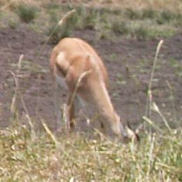
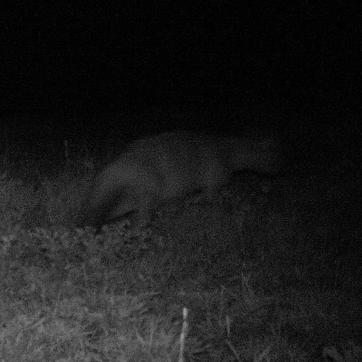
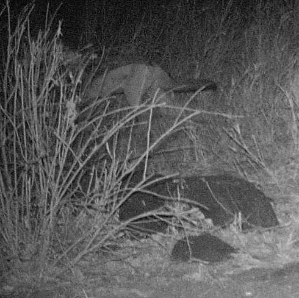
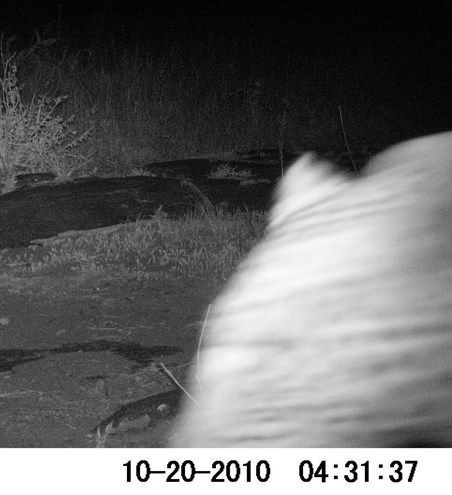
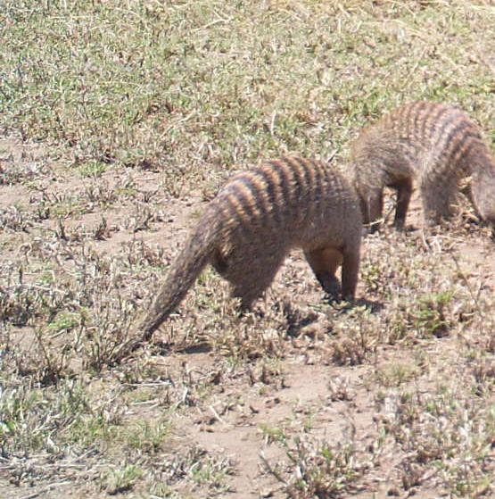
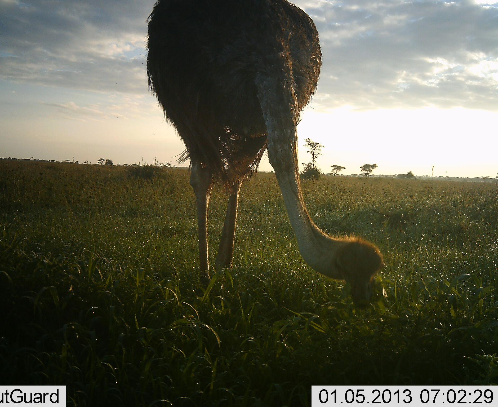
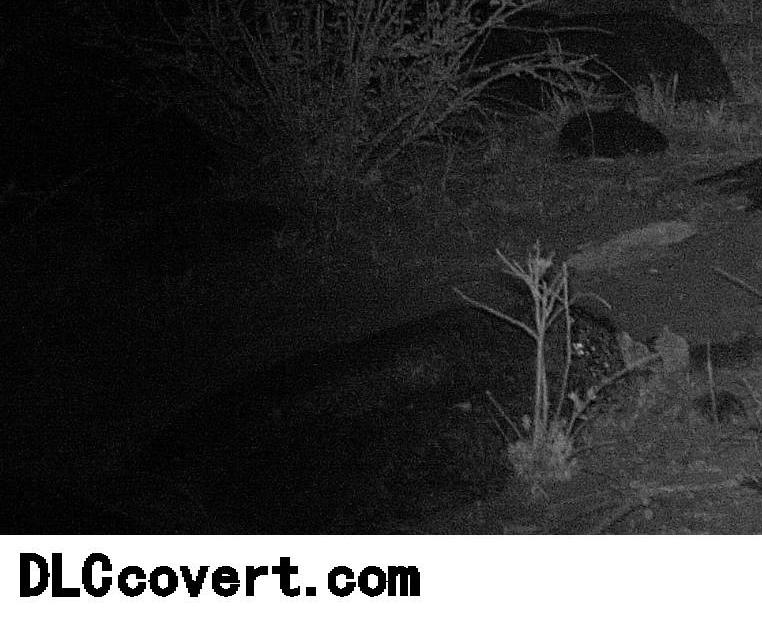
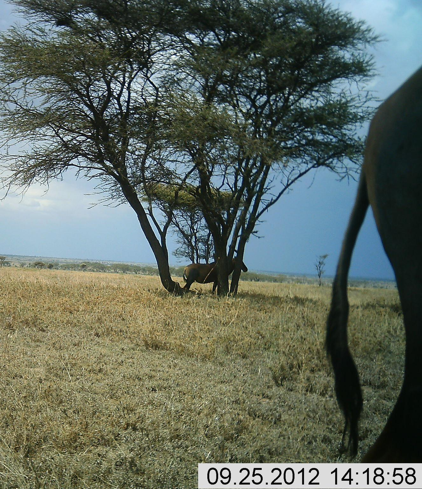
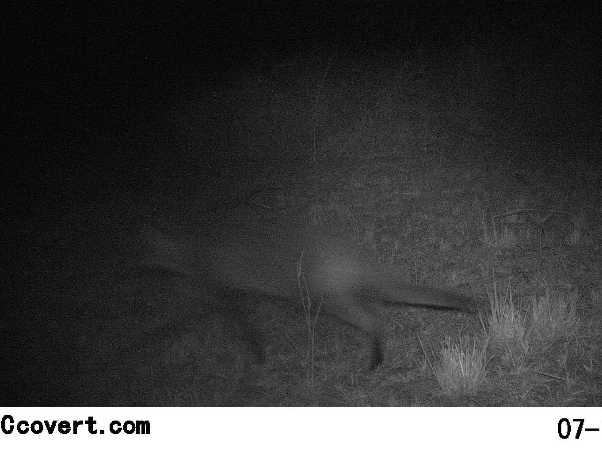
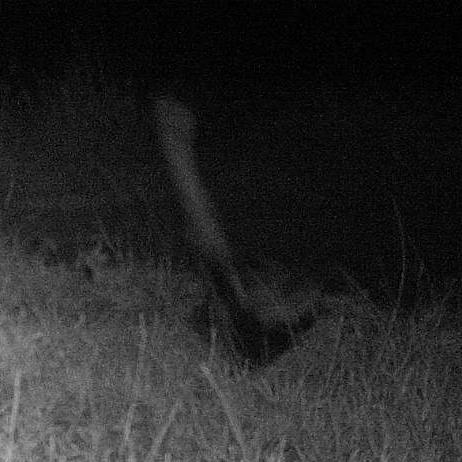

# Tutorial for training a classifier
This tutorial walks through all steps required to train an animal species classifier from an camera trap dataset. Instead of whole-image classification, we will focus on classification of the detected animals with unknown species.

## Requirements

### Hardware and software
We assume that you have a Linux-based (virtual) machine running. It is also highly recommended to use a GPU for accelerating the animal detection and classifier training. The following steps will assume, that you have already set up the NVIDIA drivers and CUDA.

First, clone this repository ([CameraTraps](https://github.com/Microsoft/CameraTraps)) to a local directory by running

```bash
CAMERATRAPS_DIR=/data/CameraTraps
git clone https://github.com/Microsoft/CameraTraps.git $CAMERATRAPS_DIR
```

Our code was tested with Python 3.6 and uses the libraries [TensorFlow](https://www.tensorflow.org/), [pycocotools](https://github.com/cocodataset/cocoapi/tree/master/PythonAPI), and the [TensorFlow object detection library](https://github.com/tensorflow/models/blob/master/research/object_detection/g3doc/installation.md). You can install the necessary libraries by running

```bash
conda env create -f ${CAMERATRAPS_DIR}/environment-classifier.yml
```

### Data
The input to our scripts is a dataset with image-level species labels. Please refer to [http://lila.science/faq](http://lila.science/faq) for more details. The scripts will assume that the location of each image is available in the json metadata.

This tutorial will use the [Snapshot Serengeti](http://lila.science/datasets/snapshot-serengeti) dataset as an example.

## Copying data
First, we will copy the image data from the blob storage to the local machine. As this process might take a while, we highly recommend running this command in a tmux or screen session. All images and the metadata will be placed in the directory `/data/serengeti`. You can run

```bash
DATASET_DIR=/data/serengeti
mkdir $DATASET_DIR && cd $DATASET_DIR
```
to assign this path to a variable called `DATASET_DIR`, create that directory, then change to it. There are two options for copying the image data from blob storage to your local machine using `azcopy`. (See installation instructions [here](https://aka.ms/azcopy).) The first (and recommended) option is to copy the image files one-by-one.

```bash
BASEURL=https://lilablobssc.blob.core.windows.net/snapshotserengeti-unzipped
SAS="?st=2020-01-01T00%3A00%3A00Z&se=2034-01-01T00%3A00%3A00Z&sp=rl&sv=2019-07-07&sr=c&sig=/DGPd%2B9WGFt6HgkemDFpo2n0M1htEXvTq9WoHlaH7L4%3D"
for SEASON in S1 S2 S3 S4 S5 S6
do
    mkdir ${SEASON}
    dest="./${SEASON}"
    azcopy cp "${BASEURL}/${SEASON}${SAS}" "${dest}" --recursive
done
```

Alternatively, if your internet connection is slow, you may consider copying the zipped archives then unzipping them yourself.

```bash
BASEURL=https://lilablobssc.blob.core.windows.net/snapshotserengeti-v-2-0
for SEASON in S01 S02 S03 S04 S05 S06
do
    dest="./${SEASON}.zip"
    azcopy cp "${BASEURL}/SnapshotSerengeti_${SEASON}_v2_0.zip" "${dest}"
    unzip -q ${dest}
    rm ${dest}
done
```

Finally, download the metadata.

```bash
dest="SnapshotSerengeti.json.zip"
azcopy cp "${BASEURL}/SnapshotSerengeti_S1-11_v2_1.json.zip" "${dest}"
unzip -q ${dest}
rm ${dest}
```

Now we are ready to run the code.

## Running the detector
The next step is creating a dataset suitable for classification training. We change into the `classification` directory:

```bash
cd $CAMERATRAPS_DIR/data_management/databases/classification
```

We will now use `make_classification_dataset.py` to generate the dataset. The script will create two output directories, one for a COCO-style classification dataset and one for a tfrecords output. While we actually only need the tfrecords output, it is recommended to create a COCO-style dataset as well. It is necessary for analyzing the created data and also contains the detected bounding boxes for each image. We will define the location of both output folders by running

```bash
COCO_STYLE_OUTPUT=$DATASET_DIR/cropped_coco_style
TFRECORDS_OUTPUT=$DATASET_DIR/cropped_tfrecords
```

We also need a frozen detection model as generated by the TensorFlow object detection API. We will assign the path to this frozen graph to a variable:

```bash
mkdir "${CAMERTRAPS_DIR}/pbs"
MEGADETECTOR_PB="${CAMERTRAPS_DIR}/pbs/md_v4.1.0.pb"
wget -O ${MEGADETECTOR_PB} https://lilablobssc.blob.core.windows.net/models/camera_traps/megadetector/md_v4.1.0/md_v4.1.0.pb
```

Now the detection can be started by running

```bash
python make_classification_dataset.py \
    $DATASET_DIR/SnapshotSerengeti.json \    # input_json
    $DATASET_DIR/ \                          # image_dir
    $MEGADETECTOR_PB \                       # frozen_graph
    --coco_style_output $COCO_STYLE_OUTPUT \
    --tfrecords_output $TFRECORDS_OUTPUT \
    --location_key location \
    --exclude_categories human empty
```

In addition to detection and cropping of detected animals, the script will also divide the data into training and testing splits based on the locations. If you would like to use a different field name for splitting the data, use the `--location_key` flag.

The script will run for days or weeks depending on the dataset size. More details on the flags are discussed in the [classification README](https://github.com/Microsoft/CameraTraps/tree/master/classification#animal-detection-and-cropping). You can go to the folder `$COCO_STYLE_OUTPUT` and analyze the generated images. The script generates one subfolder for each category.

## Dataset statistics
The number of generated images depends on the number of detected animals in the dataset as well as the how many of the images have only labeled with one species. We need the exact number of images for the classifier training. It can be computed using the script `cropped_camera_trap_dataset_statistics.py` in the same folder.

```bash
python cropped_camera_trap_dataset_statistics.py \
    $DATASET_DIR/SnapshotSerengeti.json \
    $COCO_STYLE_OUTPUT/train.json \
    $COCO_STYLE_OUTPUT/test.json \
    --classlist_output $COCO_STYLE_OUTPUT/classlist.txt
```

The script will print a complete overview of the generated data, which looks like this:

    loading annotations into memory...
    Done (t=23.26s)
    creating index...
    index created!
    Statistics of the training split:
    Locations used:
    ['B03', 'B04', 'B05', ...
    In total 49 classes and 1610503 images.
    Classes with one or more images: 47
    Images per class:
    ID    Name            Image count
        0 empty                     0
        1 human                     0
        2 gazelleGrants         28957
        3 reedbuck               3784
    ...

    Statistics of the testing split:
    Locations used:
    ['C01', 'C09', ...
    In total 49 classes and 559437 images.
    Classes with one or more images: 46
    Images per class:
    ID    Name            Image count
        0 empty                     0
        1 human                     0
        2 gazelleGrants         12710
        3 reedbuck               1060
    ...

This tells us that there are 49 classes in total. The training split has 1610503 images and the testing split 559437.

The output also contains the class distribution for each split, which allows for generating nice figures using a spreadsheet program of your choice. Copy all the lines

```
    0 empty                     0
    1 human                     0
    2 gazelleGrants         28957
    ....
```

with image counts to a text file, replace all consecutive spaces by a single comma using regular expressions, and open the file as CSV in a spreadsheet program. The program should detect the class names and image counts as separate columns. You can now create a plot such as:


## Training a classifier
With this information, we can move on to the classifier training. The training requires three things:

1. The TFRecords in `$TFRECORDS_OUTPUT` as generated above
2. A pre-trained [Inception V4 model](http://download.tensorflow.org/models/inception_v4_2016_09_09.tar.gz)
3. Slight modifications to the TensorFlow slim code in `$CAMERATRAPS_DIR/classification/tf-slim`

We already have the TFRecords, so we can directly jump to step 2, downloading the model. Let's put it in a separate directory:

```bash
PRETRAINED_DIR=/data/pretrained
mkdir $PRETRAINED_DIR && cd $PRETRAINED_DIR
wget -O inc4.tar.gz http://download.tensorflow.org/models/inception_v4_2016_09_09.tar.gz
tar xzf inc4.tar.gz
```

Now, we continue with the code modifications. Each dataset requires a separate dataset description file, which is located in
`$CAMERATRAPS_DIR/classification/tf-slim/datasets/`. We will create a file for our Serengeti dataset from scratch to explain the procedure:

```bash
cd $CAMERATRAPS_DIR/classification/tf-slim/datasets/
cp cct.py serengeti.py
```

Open the file (`serengeti.py`) and adjust lines 20 and 22 to match the our dataset numbers:

```python
SPLITS_TO_SIZES = {'train': 1610503, 'test': 559437}
_NUM_CLASSES = 49
```

Close and save the file. This description now gets connected to the rest of the code by the file `dataset_factory.py`. Open it and add an import as well as an entry to the list of datasets at line 37. The list of datasets is a dictionary called `datasets_map` and should now look like this:

```python
...
from datasets import serengeti  # <-- This is new
datasets_map = {
    'cifar10': cifar10,
    'flowers': flowers,
    'imagenet': imagenet,
    'mnist': mnist,
    'cct': cct,
    'wellington': wellington,
    'serengeti': serengeti, # <-- This is new
    'nacti': nacti
    ...
}
```

Now everything is prepared. The easiest way to start the training is by adapting one of the existing training scripts. We first switch to the classification directory, which contains several sample scripts for the training. As before, we will adapt an existing file to our needs:

```bash
cd $CAMERATRAPS_DIR/classification/training_scripts
cp train_cct_inception_v4.sh train_serengeti_inception_v4.sh
```

Open `train_serengeti_inception_v4.sh` with a text editor and adjust
- `DATASET_NAME` to the key used in the dict `datasets_map` above, in our case `serengeti`
- `DATASET_DIR` to the path to your TFRecords folder `$TFRECORDS_OUTPUT`
- `CHECKPOINT_PATH` to the path of the checkpoint located at `$PRETRAINED_DIR/inception_v4.ckpt`

In our case, these three values would look like this

```bash
DATASET_DIR=/data/serengeti/cropped_tfrecords
DATASET_NAME=serengeti
CHECKPOINT_PATH=/data/pretrained/inception_v4.ckpt
```

You might also want to adjust the number of training steps by changing the value of `--max_number_of_steps` at [line 51](https://github.com/Microsoft/CameraTraps/blob/classification/classification/train_serengeti_inception_v4.sh#L51). A good starting value is 30 epochs, which translates to

    NUM_EPOCHS * NUM_TRAINING_IMAGES / BATCH_SIZE

steps. The longer you run the training, the better the accuracy might be. We are now ready to start the training! Go to the TensorFlow slim directory and start the training with

```bash
cd $CAMERATRAPS_DIR/classification/tf-slim
bash ../training_scripts/train_serengeti_inception_v4.sh
```

The training will take several days to complete. It is a two-step training, in which we first train only the last layer of the network. Afterward, all parameters are trained jointly.

NOTE: It appears that there is a bug in the tf-slim code, which manifests in a significantly lower accuracy, e.g., 10% lower than expected. If you experience issues with low accuracy values, try the following fix. After the training is finished, locate the created log directory, change the variable `TRAIN_DIR` in `../training_scripts/train_serengeti_inception_v4.sh` to this folder. Now re-run `bash ../training_scripts/train_serengeti_inception_v4.sh`. The tensorflow training will recognize the existing checkpoints, read the model, and write out a new bug-free model.

## Evaluating the classifier
The sample training scripts will run an evaluation run on the test data after the training finished. This evaluation run can be repeated later as well. We will adapt an existing evaluation script for this purpose. First, switch to the directory containing the sample scripts and copy one of the existing scripts with

```bash
cd $CAMERATRAPS_DIR/classification/training_scripts
cp eval_cct_inception_v4.sh eval_serengeti_inception_v4.sh
```

This script needs similar adjustments as the training script created in the previous section. Open the script `eval_serengeti_inception_v4.sh` with a text editor like `vim` by executing

```bash
vim eval_serengeti_inception_v4.sh
```

and set the variables in the top:
- `DATASET_NAME` to the key used in the training script, in our case `serengeti`
- `DATASET_DIR` to the path to your TFRecords folder `$TFRECORDS_OUTPUT`
- `CHECKPOINT_PATH` to the subfolder `all` of your log directory

One log folder is created for each training run in the directory

    $CAMERATRAPS_DIR/classification/tf-slim/log

and the folder name contains the starting date and time. Double check that that you pick the correct path as the evaluation will run even with an invalid path. In our case, the top of the script looks like this

```bash
DATASET_DIR=/data/serengeti/cropped_tfrecords
DATASET_NAME=serengeti
CHECKPOINT_DIR=/data/CameraTraps/classification/tf-slim/log/2019-02-22_07.05.54_well_incv4/all/
```

The script is now ready for execution. Change to the `tf-slim` folder and start the evaluation run with

```bash
cd $CAMERATRAPS_DIR/classification/tf-slim
bash ../training_scripts/eval_serengeti_inception_v4.sh
```

As before, the accuracy will be printed at the end:

    ...
    INFO:tensorflow:Evaluation [3951/4393]
    INFO:tensorflow:Evaluation [4390/4393]
    INFO:tensorflow:Evaluation [4393/4393]
    eval/Accuracy[0.863694489]eval/Recall_5[0.969760954]

    INFO:tensorflow:Finished evaluation at 2019-05-07-03:34:21

The outputs `eval/Accuracy` and `eval/Recall_5` correspond to the top-1 and top-5 accuracy with values in [0,1].

## Single-image prediction
The trained model can be deployed and used for single-image prediction. The first step is exporting the model definition and creating a frozen graph. Start by changing to the `tf-slim` folder and setting `CHECKPOINT_PATH` to point to the subfolder `all` of your training log directory. We can now start exporting the model definition by running

```bash
cd $CAMERATRAPS_DIR/classification/tf-slim

CHECKPOINT_DIR=/data/CameraTraps/classification/tf-slim/log/2019-02-22_07.05.54_well_incv4/all/

python ../export_inference_graph_definition.py \
    --model_name=inception_v4 \
    --output_file=${CHECKPOINT_DIR}/inception_v4_inf_graph_def.pbtxt \
    --dataset_name=serengeti \
    --write_text_graphdef=True
```

where `$CHECKPOINT_DIR` is the path to the log directory of the model training as above. The export command will create a file called `inception_v4_inf_graph_def.pbtxt` in the log directory, which represents the structure of the classification model. The file does not contain the learned model parameters yet. These values are stored in the checkpoint files starting with `model.ckpt...`.

We will now fuse the model structure and learned parameter values into one file, which is called frozen graph:

```bash
python ../freeze_graph.py \
    --input_graph=${CHECKPOINT_DIR}/inception_v4_inf_graph_def.pbtxt \
    --input_checkpoint=`ls ${CHECKPOINT_DIR}/model.ckpt*meta | tail -n 1 | rev | cut -c 6- | rev` \
    --output_graph=${CHECKPOINT_DIR}/frozen_inference_graph_w_preprocessing.pb \
    --input_node_names=input \
    --output_node_names=output \
    --clear_devices=True
```

You should be able to run this command without any modification as the only bash variable here is `$CHECKPOINT_DIR`. The script will create a file called `frozen_inference_graph_w_preprocessing.pb` in the folder `$CHECKPOINT_DIR`, which is a deployable self-contained inference model. This model also contains all image preprocessing steps required.

We now can predict the category of a new image as follows. First, change to the `classification` directory. This folder contains the script `predict_image.py`, which takes the frozen graph, a list of class names, and an image as input. It will then read the image, pass it to the classification model, and print the five most likely categories.

```bash
cd $CAMERATRAPS_DIR/classification

python predict_image.py \
    --frozen_graph ${CHECKPOINT_DIR}/frozen_inference_graph_w_preprocessing.pb \
    --classlist $COCO_STYLE_OUTPUT/classlist.txt \
    --image_path $COCO_STYLE_OUTPUT/gazelleThomsons/S2/L12/L12_R1/S2_L12_R1_PICT2280.JPG
```

This command will analyze the testing image `$COCO_STYLE_OUTPUT/gazelleThomsons/S2/L12/L12_R1/S2_L12_R1_PICT2280.JPG`, which looks like



and print the following output:

    ...
    Prediction finished. Most likely classes:
        "gazelleThomsons" with confidence 86.55%
        "gazelleGrants" with confidence 12.51%
        "dikDik" with confidence 0.29%
        "vervetMonkey" with confidence 0.11%
        "otherBird" with confidence 0.11%

NOTE: The prediction only works properly if the frozen graph is generated by the script `../freeze_graph.py` as shown above. The frozen graph that is generated automatically by tensorflow slim training does not include the image pre-processing and hence might result in less accurate predictions.

## Joint detection an classification
The repository also contains a script for test-driving the joint detection and classification. We assume that you already performed the model export as shown in the previous section about single-image prediction. From the `classification` directory you may run

```bash
cd $CAMERATRAPS_DIR/classification

python detect_and_predict_image.py \
    --classes_file $COCO_STYLE_OUTPUT/classlist.txt \
    --image_file $COCO_STYLE_OUTPUT/gazelleThomsons/S2/L12/L12_R1/S2_L12_R1_PICT2280.JPG \
    $FROZEN_DETECTION_GRAPH \
    ${CHECKPOINT_DIR}/frozen_inference_graph_w_preprocessing.pb
```

The script will run the detector on the image and apply the classifier to each detected box that has a high confidence. The results are plotted as an image and save to the folder containing the input images. The file name will be the original file name with a `_detections.jpg` attached. In our case, the output looks like


## Sampling testing images
For visualization and debugging purposes, we also provide a script to randomly sample testing images and run the prediction on each of those. The script is located in the `classification` subfolder. Execute the script as follows:

```bash
cd $CAMERATRAPS_DIR/classification/

python generate_sample_predictions.py \
    --frozen_graph ${CHECKPOINT_DIR}/frozen_inference_graph_w_preprocessing.pb \
    --test_json     $COCO_STYLE_OUTPUT/test.json
```

By default, the output will be placed in a subfolder called `./sample_output` and ten images are selected. The images are sampled equally from all classes.

Running the script as shown results in ten images and ten corresponding text files, whose name is derived from the original path and file name:

    ./sample_output/aardwolf___S2___T12___T12_R2___S2_T12_R2_PICT0590.JPG
    ./sample_output/aardwolf___S2___T12___T12_R2___S2_T12_R2_PICT0590.txt
    ./sample_output/caracal___S1___P10___P10_R1___S1_P10_R1_PICT0120.JPG
    ./sample_output/caracal___S1___P10___P10_R1___S1_P10_R1_PICT0120.txt
    ...

The text files contain the names of the predicted classes along with the prediction confidence. We show the first few examples below.



    Predicting aardwolf/S2/T12/T12_R2/S2_T12_R2_PICT0590.JPG
    Most likely classes:
        "aardwolf" with confidence 71.48%
        "hyenaStriped" with confidence 28.11%
        "batEaredFox" with confidence 0.31%
        "hyenaSpotted" with confidence 0.07%
        "civet" with confidence 0.02%



    Predicting civet/S1/H06/H06_R3/S1_H06_R3_PICT0736_1.JPG
    Most likely classes:
        "rodents" with confidence 28.20%
        "batEaredFox" with confidence 23.55%
        "jackal" with confidence 21.78%
        "wildcat" with confidence 5.08%
        "honeyBadger" with confidence 4.39%



    Predicting leopard/S1/H06/H06_R4/S1_H06_R4_PICT1296_0.JPG
    Most likely classes:
        "leopard" with confidence 68.30%
        "porcupine" with confidence 9.40%
        "serval" with confidence 7.13%
        "cheetah" with confidence 4.95%
        "wildcat" with confidence 3.02%



    Predicting mongoose/S1/R11/R11_R1/S1_R11_R1_PICT0101_1.JPG
    Most likely classes:
        "mongoose" with confidence 100.00%
        "reptiles" with confidence 0.00%
        "batEaredFox" with confidence 0.00%
        "aardvark" with confidence 0.00%
        "honeyBadger" with confidence 0.00%



    Predicting ostrich/S6/P05/P05_R1/S6_P05_R1_IMAG0118.JPG
    Most likely classes:
        "ostrich" with confidence 99.72%
        "otherBird" with confidence 0.23%
        "koriBustard" with confidence 0.04%
        "giraffe" with confidence 0.01%
        "wildebeest" with confidence 0.00%



    Predicting porcupine/S1/H06/H06_R4/S1_H06_R4_PICT1178_1.JPG
    Most likely classes:
        "elephant" with confidence 30.68%
        "porcupine" with confidence 22.94%
        "hippopotamus" with confidence 6.46%
        "buffalo" with confidence 6.43%
        "hyenaSpotted" with confidence 5.84%



    Predicting topi/S5/T10/T10_R3/S5_T10_R3_IMAG0176_1.JPG
    Most likely classes:
        "wildebeest" with confidence 81.82%
        "buffalo" with confidence 11.10%
        "topi" with confidence 3.79%
        "eland" with confidence 2.59%
        "hartebeest" with confidence 0.53%



    Predicting wildcat/S2/D03/D03_R4/S2_D03_R4_PICT0414.JPG
    Most likely classes:
        "batEaredFox" with confidence 77.14%
        "honeyBadger" with confidence 13.73%
        "zorilla" with confidence 3.02%
        "mongoose" with confidence 2.76%
        "civet" with confidence 1.93%



    Predicting zorilla/S2/K13/K13_R1/S2_K13_R1_PICT0664.JPG
    Most likely classes:
        "wildebeest" with confidence 78.91%
        "ostrich" with confidence 7.30%
        "topi" with confidence 5.06%
        "buffalo" with confidence 1.13%
        "hartebeest" with confidence 0.83%
