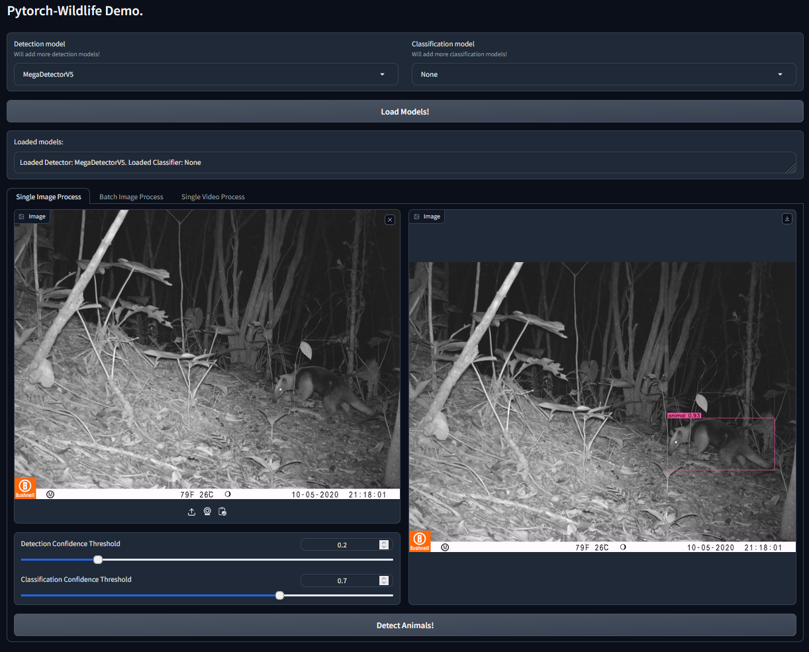
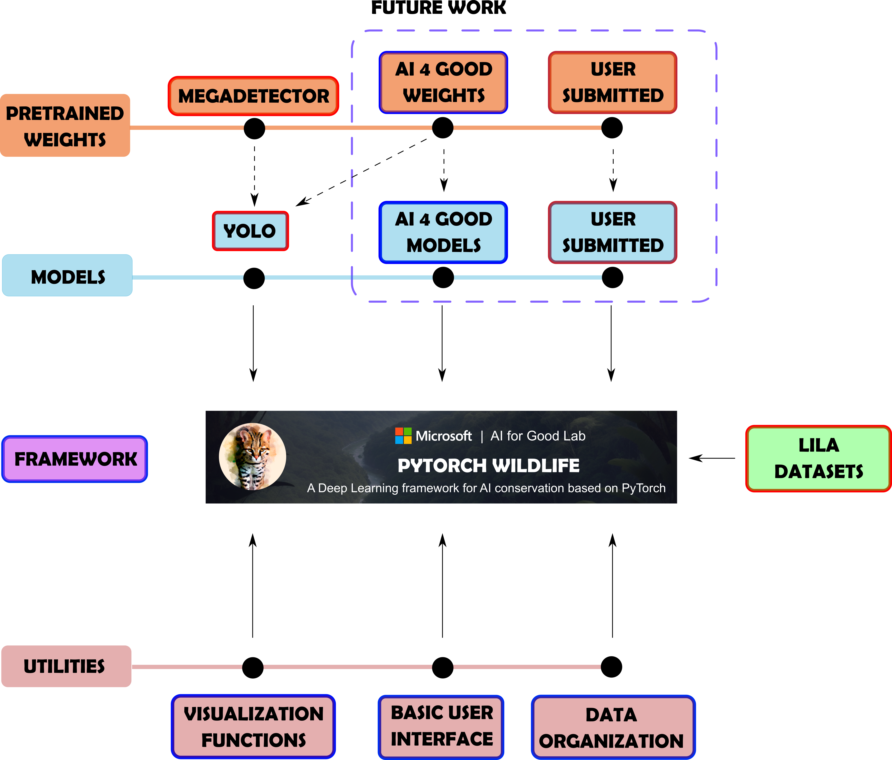
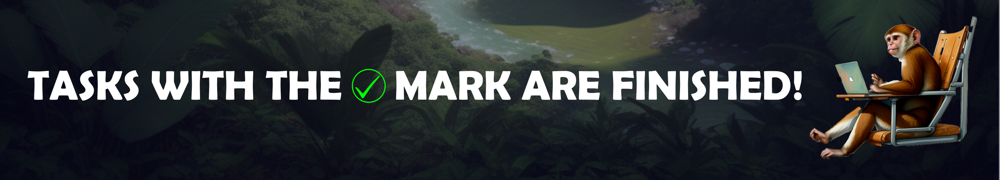
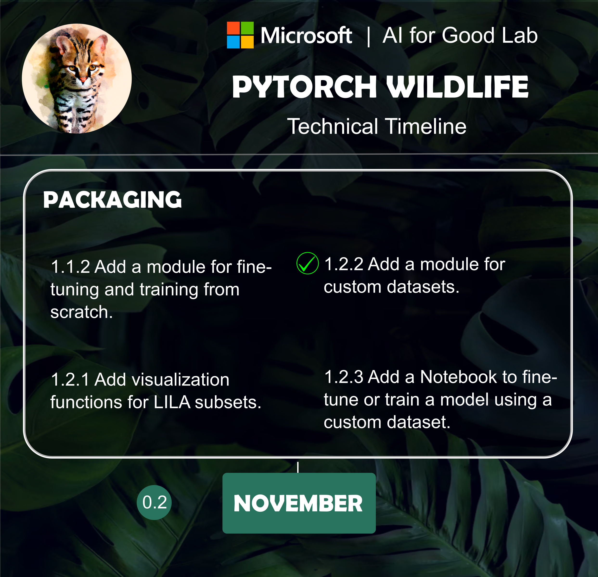
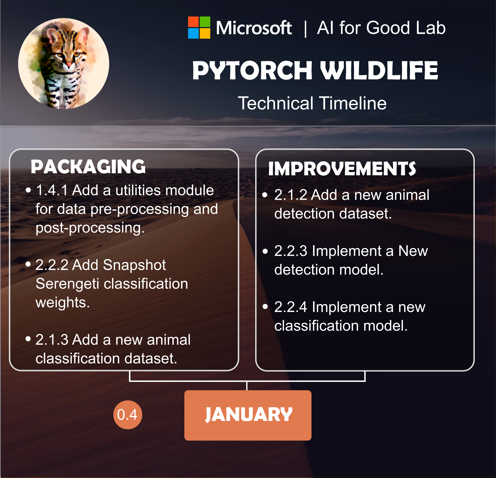
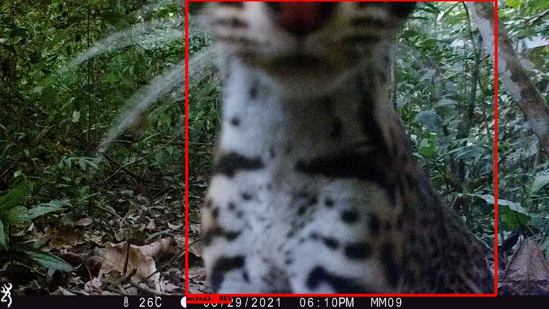
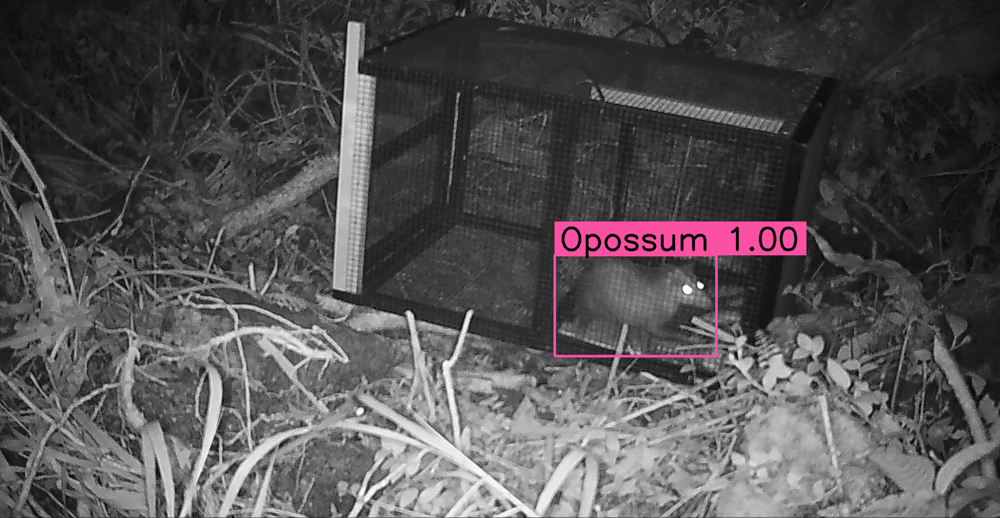

# Pytorch-Wildlife: A Collaborative Deep Learning Framework for Conservation
 
## Announcement
 
At the core of our mission is the desire to create a harmonious space where conservation scientists from all over the globe can unite, share, and grow. We are expanding the CameraTraps repo to introduce **Pytorch-Wildlife**, a Collaborative Deep Learning Framework for Conservation, where researchers can come together to share and use datasets and deep learning architectures for wildlife conservation.
 
We've been inspired by the potential and capabilities of Megadetector, and we deeply value its contributions to the community. **As we forge ahead with Pytorch-Wildlife, under which Megadetector now resides, please know that we remain committed to supporting, maintaining, and developing Megadetector, ensuring its continued relevance, expansion, and utility.**

To use the newest version of MegaDetector with all the exisitng functionatlities, you can use our newly developed [user interface](#explore-pytorch-wildlife-and-megadetector-with-our-user-interface) or simply load the model with **Pytorch-Wildlife** and the weights will be automatically downloaded:

```python
from PytorchWildlife.models import detection as pw_detection
detection_model = pw_detection.MegaDetectorV5()
```

If you'd like to learn more about **Pytorch-Wildlife**, please continue reading.

For those interested in accessing the previous MegaDetector repository, which utilizes the same `MegaDetector v5` model weights and was primarily developed by Dan Morris during his time at Microsoft, please visit the [archive](./archive) directory, or you can visit this [forked repository](https://github.com/agentmorris/MegaDetector/tree/main) that Dan Morris is actively maintaining.
 
**If you have any questions regarding MegaDetector and Pytorch-Wildlife, please <a href="mailto:zhongqimiao@microsoft.com">email us</a>!**
 
## Table of contents

- [Pytorch-Wildlife: A Collaborative Deep Learning Framework for Conservation](#pytorch-wildlife-a-collaborative-deep-learning-framework-for-conservation)
  - [Announcement](#announcement)
  - [Table of contents](#table-of-contents)
  - [Welcome to Pytorch-Wildlife Version 1.0](#welcome-to-pytorch-wildlife-version-10)
  - [Explore Pytorch-Wildlife and MegaDetector with Our User Interface](#explore-pytorch-wildlife-and-megadetector-with-our-user-interface)
  - [Core Features of Pytorch-Wildlife](#core-features-of-pytorch-wildlife)
    - [What are the core components of Pytorch-Wildlife?](#what-are-the-core-components-of-pytorch-wildlife)
    - [Progress on the core tasks](#progress-on-the-core-tasks)
    - [Development roadmap](#development-roadmap)
  - [Examples!](#examples)
    - [Image detection using `MegaDetector v5`](#image-detection-using-megadetector-v5)
    - [Image classification with `MegaDetector v5` and `AI4GAmazonRainforest`](#image-classification-with-megadetector-v5-and-ai4gamazonrainforest)
    - [Opossum ID with `MegaDetector v5` and `AI4GOpossum`](#opossum-id-with-megadetector-v5-and-ai4gopossum)
  - [Contributing](#contributing)
  - [Existing Collaborators](#existing-collaborators)
  - [License](#license)

 
## Welcome to Pytorch-Wildlife Version 1.0
 
**PyTorch-Wildlife** is a platform to create, modify, and share powerful AI conservation models. These models can be used for a variety of applications, including camera trap images, overhead images, underwater images, or bioacoustics. Your engagement with our work is greatly appreciated, and we eagerly await any feedback you may have.

The **Pytorch-Wildlife** library allows users to directly load the `MegaDetector v5` model weights for animal detection. We've fully refactored our codebase, prioritizing ease of use in model deployment and expansion. In addition to ``MegaDetector v5``, **Pytorch-Wildlife** also accommodates a range of classification weights, such as those derived from the Amazon Rainforest dataset and the Opossum classification dataset.
Explore the codebase and  functionalities of **Pytorch-Wildlife** through our interactive `Gradio` web app and detailed Jupyter notebooks, designed to showcase the practical applications of our enhancements at [PyTorchWildlife](INSTALLATION.md). You can find more information in our [documentation](https://cameratraps.readthedocs.io/en/latest/).
 
Here is a brief example on how to perform detection and classification on a single image using `PyTorch-wildlife`:

```python
import torch
from PytorchWildlife.models import detection as pw_detection
from PytorchWildlife.models import classification as pw_classification

img = torch.randn((3, 1280, 1280))

# Detection
detection_model = pw_detection.MegaDetectorV5() # Model weights are automatically downloaded.
detection_result = detection_model.single_image_detection(img)

#Classification
classification_model = pw_classification.AI4GAmazonRainforest() # Model weights are automatically downloaded.
classification_results = classification_model.single_image_classification(img)
```
 
## Explore Pytorch-Wildlife and MegaDetector with Our User Interface
 
If you want to directly try **Pytorch-Wildlife** with the AI models available, including `MegaDetector v5`, you can use our **Gradio** interface. This interface allows users to directly load the `MegaDetector v5` model weights for animal detection. In addition, **Pytorch-Wildlife** also has two classification models in our initial version. One is trained from an Amazon Rainforest camera trap dataset and the other from a Galapagos opossum classification dataset (more details of these datasets will be published soon). To start, please follow the [installation instructions](INSTALLATION.md) on how to run the **Gradio** interface! We also provide multiple [**Jupyter** notebooks](https://github.com/microsoft/CameraTraps/tree/main/demo) for demonstation.




## Core Features of Pytorch-Wildlife



### What are the core components of Pytorch-Wildlife?

- **Unified Framework**: **Pytorch-Wildlife** integrates four pivotal elements:
  - Machine Learning Models
  - Pre-trained Weights
  - Datasets
  - Utilities
 
- **Our work**: In the provided graph, boxes outlined in red represent elements that will be added and remained fixed, while those in blue will be part of our development.

- **Inaugural Model**: We're kickstarting with YOLO as our first available model, complemented by pre-trained weights from `MegaDetector v5`. This is the same `MegaDetector v5` model from the previous repository.

- **Expandable Repository**: As we move forward, our platform will welcome new models and pre-trained weights for camera traps and bioacoustic analysis. We're excited to host contributions from global researchers through a dedicated submission platform.

- **Datasets from LILA**: **Pytorch-Wildlife** will also incorporate the vast datasets hosted on LILA, making it a treasure trove for conservation research.

- **Versatile Utilities**: Our set of utilities spans from visualization tools to task-specific utilities, many inherited from Megadetector.

- **User Interface Flexibility**: While we provide a foundational user interface, our platform is designed to inspire. We encourage researchers to craft and share their unique interfaces, and we'll list both existing and new UIs from other collaborators for the community's benefit.

Let's shape the future of wildlife research, together!

### Progress on the core tasks

Below you can find our progress in these core tasks:



### Development roadmap
Here you can find details of the milestone roadmap for **Pytorch-Wildlife**:







## Examples!
### Image detection using `MegaDetector v5`


Credits to Universidad de los Andes, Colombia.
### Image classification with `MegaDetector v5` and `AI4GAmazonRainforest`


Credits to Universidad de los Andes, Colombia.
### Opossum ID with `MegaDetector v5` and `AI4GOpossum`


Credits to the Agency for Regulation and Control of Biosecurity and Quarantine for Galápagos (ABG), Ecuador.

## Contributing
This project welcomes contributions and suggestions. If you would like to submit a pull request, we will publish a contribution guideline soon.

This project has adopted the [Microsoft Open Source Code of Conduct](https://opensource.microsoft.com/codeofconduct/). For more information see the [Code of Conduct FAQ](https://opensource.microsoft.com/codeofconduct/faq/) or contact <a href="mailto:zhongqimiao@microsoft.com">zhongqimiao@microsoft.com</a> with any additional questions or comments.

## Existing Collaborators

Here are a few of the organizations that have used MegaDetector. We're only listing organizations who (a) we know about and (b) have given us permission to refer to them here (or have posted publicly about their use of MegaDetector).

The extensive collaborative efforts of Megadetector have genuinely inspired us, and we deeply value its significant contributions to the community. As we continue to advance with Pytorch-Wildlife, our commitment to delivering technical support to our existing partners on MegaDetector remains the same.

If you have any questions regarding MegaDetector, want to become a collaborator, or would like to be added to this list, please <a href="mailto:zhongqimiao@microsoft.com">email us</a>!

* [Arizona Department of Environmental Quality](http://azdeq.gov/)
* [Blackbird Environmental](https://blackbirdenv.com/)
* [Camelot](https://camelotproject.org/)
* [Canadian Parks and Wilderness Society (CPAWS) Northern Alberta Chapter](https://cpawsnab.org/)
* [Conservation X Labs](https://conservationxlabs.com/)
* [Czech University of Life Sciences Prague](https://www.czu.cz/en)
* [EcoLogic Consultants Ltd.](https://www.consult-ecologic.com/)
* [Estación Biológica de Doñana](http://www.ebd.csic.es/inicio)
* [Idaho Department of Fish and Game](https://idfg.idaho.gov/)
* [Island Conservation](https://www.islandconservation.org/)
* [Myall Lakes Dingo Project](https://carnivorecoexistence.info/myall-lakes-dingo-project/)
* [Point No Point Treaty Council](https://pnptc.org/)
* [Ramat Hanadiv Nature Park](https://www.ramat-hanadiv.org.il/en/)
* [SPEA (Portuguese Society for the Study of Birds)](https://spea.pt/en/)
* [Synthetaic](https://www.synthetaic.com/)
* [Taronga Conservation Society](https://taronga.org.au/)
* [The Nature Conservancy in Wyoming](https://www.nature.org/en-us/about-us/where-we-work/united-states/wyoming/)
* [TrapTagger](https://wildeyeconservation.org/trap-tagger-about/)
* [Upper Yellowstone Watershed Group](https://www.upperyellowstone.org/)

* [Applied Conservation Macro Ecology Lab](http://www.acmelab.ca/), University of Victoria
* [Banff National Park Resource Conservation](https://www.pc.gc.ca/en/pn-np/ab/banff/nature/conservation), Parks Canada
* [Blumstein Lab](https://blumsteinlab.eeb.ucla.edu/), UCLA
* [Borderlands Research Institute](https://bri.sulross.edu/), Sul Ross State University
* [Capitol Reef National Park](https://www.nps.gov/care/index.htm) / Utah Valley University
* [Center for Biodiversity and Conservation](https://www.amnh.org/research/center-for-biodiversity-conservation), American Museum of Natural History
* [Centre for Ecosystem Science](https://www.unsw.edu.au/research/), UNSW Sydney
* [Cross-Cultural Ecology Lab](https://crossculturalecology.net/), Macquarie University
* [DC Cat Count](https://hub.dccatcount.org/), led by the Humane Rescue Alliance
* [Department of Fish and Wildlife Sciences](https://www.uidaho.edu/cnr/departments/fish-and-wildlife-sciences), University of Idaho
* [Department of Wildlife Ecology and Conservation](https://wec.ifas.ufl.edu/), University of Florida
* [Ecology and Conservation of Amazonian Vertebrates Research Group](https://www.researchgate.net/lab/Fernanda-Michalski-Lab-4), Federal University of Amapá
* [Gola Forest Programma](https://www.rspb.org.uk/our-work/conservation/projects/scientific-support-for-the-gola-forest-programme/), Royal Society for the Protection of Birds (RSPB)
* [Graeme Shannon's Research Group](https://wildliferesearch.co.uk/group-1), Bangor University 
* [Hamaarag](https://hamaarag.org.il/), The Steinhardt Museum of Natural History, Tel Aviv University
* [Institut des Science de la Forêt Tempérée](https://isfort.uqo.ca/) (ISFORT), Université du Québec en Outaouais
* [Lab of Dr. Bilal Habib](https://bhlab.in/about), the Wildlife Institute of India
* [Mammal Spatial Ecology and Conservation Lab](https://labs.wsu.edu/dthornton/), Washington State University
* [McLoughlin Lab in Population Ecology](http://mcloughlinlab.ca/lab/), University of Saskatchewan
* [National Wildlife Refuge System, Southwest Region](https://www.fws.gov/about/region/southwest), U.S. Fish & Wildlife Service
* [Northern Great Plains Program](https://nationalzoo.si.edu/news/restoring-americas-prairie), Smithsonian
* [Quantitative Ecology Lab](https://depts.washington.edu/sefsqel/), University of Washington
* [Santa Monica Mountains Recreation Area](https://www.nps.gov/samo/index.htm), National Park Service
* [Seattle Urban Carnivore Project](https://www.zoo.org/seattlecarnivores), Woodland Park Zoo
* [Serra dos Órgãos National Park](https://www.icmbio.gov.br/parnaserradosorgaos/), ICMBio
* [Snapshot USA](https://emammal.si.edu/snapshot-usa), Smithsonian
* [Wildlife Coexistence Lab](https://wildlife.forestry.ubc.ca/), University of British Columbia
* [Wildlife Research](https://www.dfw.state.or.us/wildlife/research/index.asp), Oregon Department of Fish and Wildlife
* [Wildlife Division](https://www.michigan.gov/dnr/about/contact/wildlife), Michigan Department of Natural Resources

* Department of Ecology, TU Berlin
* Ghost Cat Analytics
* Protected Areas Unit, Canadian Wildlife Service

* [School of Natural Sciences](https://www.utas.edu.au/natural-sciences), University of Tasmania ([story](https://www.utas.edu.au/about/news-and-stories/articles/2022/1204-innovative-camera-network-keeps-close-eye-on-tassie-wildlife))
* [Kenai National Wildlife Refuge](https://www.fws.gov/refuge/kenai), U.S. Fish & Wildlife Service ([story](https://www.peninsulaclarion.com/sports/refuge-notebook-new-technology-increases-efficiency-of-refuge-cameras/))

* [Australian Wildlife Conservancy](https://www.australianwildlife.org/) ([blog](https://www.australianwildlife.org/cutting-edge-technology-delivering-efficiency-gains-in-conservation/), [blog](https://www.australianwildlife.org/efficiency-gains-at-the-cutting-edge-of-technology/))
* [Felidae Conservation Fund](https://felidaefund.org/) ([WildePod platform](https://wildepod.org/)) ([blog post](https://abhaykashyap.com/blog/ai-powered-camera-trap-image-annotation-system/))
* [Alberta Biodiversity Monitoring Institute (ABMI)](https://www.abmi.ca/home.html) ([WildTrax platform](https://www.wildtrax.ca/)) ([blog post](https://wildcams.ca/blog/the-abmi-visits-the-zoo/))
* [Shan Shui Conservation Center](http://en.shanshui.org/) ([blog post](https://mp.weixin.qq.com/s/iOIQF3ckj0-rEG4yJgerYw?fbclid=IwAR0alwiWbe3udIcFvqqwm7y5qgr9hZpjr871FZIa-ErGUukZ7yJ3ZhgCevs)) ([translated blog post](https://mp-weixin-qq-com.translate.goog/s/iOIQF3ckj0-rEG4yJgerYw?fbclid=IwAR0alwiWbe3udIcFvqqwm7y5qgr9hZpjr871FZIa-ErGUukZ7yJ3ZhgCevs&_x_tr_sl=auto&_x_tr_tl=en&_x_tr_hl=en&_x_tr_pto=wapp))
* [Irvine Ranch Conservancy](http://www.irconservancy.org/) ([story](https://www.ocregister.com/2022/03/30/ai-software-is-helping-researchers-focus-on-learning-about-ocs-wild-animals/))
* [Wildlife Protection Solutions](https://wildlifeprotectionsolutions.org/) ([story](https://customers.microsoft.com/en-us/story/1384184517929343083-wildlife-protection-solutions-nonprofit-ai-for-earth), [story](https://www.enterpriseai.news/2023/02/20/ai-helps-wildlife-protection-solutions-safeguard-endangered-species/))

* [Road Ecology Center](https://roadecology.ucdavis.edu/), University of California, Davis ([Wildlife Observer Network platform](https://wildlifeobserver.net/))
* [The Nature Conservancy in California](https://www.nature.org/en-us/about-us/where-we-work/united-states/california/) ([Animl platform](https://github.com/tnc-ca-geo/animl-frontend))
* [San Diego Zoo Wildlife Alliance](https://science.sandiegozoo.org/)  ([Animl R package](https://github.com/conservationtechlab/animl))

## License

This repository is licensed with the [MIT license](https://github.com/Microsoft/dotnet/blob/main/LICENSE).

