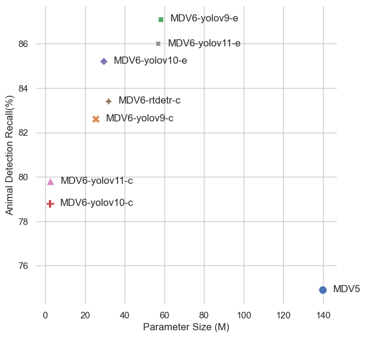

# 🐾 Pytorch-Wildlife and MegaDetector

> [!TIP]
> MegaDetector now resides in [Pytorch-Wildlife](https://microsoft.github.io/CameraTraps/megadetector/) as part of the [model zoo](https://microsoft.github.io/CameraTraps/model_zoo/megadetector/).

**At the core of our mission is the desire to create a harmonious space where conservation scientists from all over the globe can unite. Where they're able to share, grow, use datasets and deep learning architectures for wildlife conservation.
We've been inspired by the potential and capabilities of Megadetector, and we deeply value its contributions to the community. As we forge ahead with Pytorch-Wildlife, under which Megadetector now resides, please know that we remain committed to supporting, maintaining, and developing Megadetector, ensuring its continued relevance, expansion, and utility.**


## :racing_car::dash::dash: MegaDetectorV6: SMALLER, FASTER, BETTER!  
We have officially released our 6th version of MegaDetector, MegaDetectorV6! In the next generation of MegaDetector, we are focusing on computational efficiency, performance, modernizing of model architectures, and licensing. We have trained multiple new models using different model architectures, including Yolo-v9, Yolo-v10, and RT-Detr for maximum user flexibility. We have a [rolling release schedule](#mag-model-zoo-and-release-schedules) for different versions of MegaDetectorV6.

MegaDetectorV6 models are based on architectures optimized for performance and low-budget devices. For example, the MegaDetectorV6-Ultralytics-YoloV10-Compact (MDV6-yolov10-c) model only have ***2% of the parameters*** of the previous MegaDetectorV5 and still exhibits comparable animal recall on our validation datasets. 

To use the newest version of MegaDetector with all the existing functionalities, you can use our [Hugging Face interface](https://huggingface.co/spaces/ai-for-good-lab/pytorch-wildlife) or simply load the model with **Pytorch-Wildlife**. The weights will be automatically downloaded: 
```python
from PytorchWildlife.models import detection as pw_detection
detection_model = pw_detection.MegaDetectorV6()
```

> [!TIP]
> All versions of MegaDetectorV6 can be found in the [model zoo](https://microsoft.github.io/CameraTraps/model_zoo/megadetector/).

<!-- In the following figure, we can see the Performance to Parameter metric of each released MegaDetector model. All of the V6 models, extra large or compact, have at least 50% less parameters compared to MegaDetectorV5 but with much higher animal detection performance. -->

<!--  -->

<!-- >[!TIP] -->
<!-- >From now on, we encourage our users to use MegaDetectorV6 as their default animal detection model and choose whichever model that fits the project needs. To reduce potential confusion, we have also standardized the model names into MDV6-Compact and MDV6-Extra for two model sizes using the same architecture. Learn how to use MegaDetectorV6 in our [image demo](demo/image_detection_demo_v6.ipynb) and [video demo](demo/video_detection_demo_v6.ipynb). -->

>[!NOTE]
> - Following our initial release, we’ve been delighted to see so many people explore our new models. We’d like to extend our heartfelt thanks to everyone who has shown interest in our latest models—your support means a great deal to us!
> - That said, we’ve received a number of feedback comments highlighting a discrepancy between the reported performance (particularly MDV5) and the actual performance observed. We are actively investigating this issue and have identified a potential error or corruption in the validation data we used. For the time being, we’ll remove our current performance numbers from the model zoo for now to avoid confusion.
> - We sincerely apologize for any confusion or inconvenience this may have caused. Our team is working diligently to address this matter, and we will update our experiments—and potentially retrain the model if data corruption is confirmed—as soon as possible. Thank you for your patience and understanding!


## MegaDetectorV5 and Archive Repos

For those interested in accessing the previous MegaDetector repository, which utilizes the same `MegaDetectorV5` model weights and was primarily developed by Dan Morris during his time at Microsoft, please visit the [archive branch](https://github.com/microsoft/CameraTraps/tree/archive) , or you can visit this [forked repository](https://github.com/agentmorris/MegaDetector/tree/main) that Dan Morris is currently actively maintaining.

>[!TIP]
>If you have any questions regarding MegaDetector and Pytorch-Wildlife, please [email us](mailto:zhongqimiao@microsoft.com) or join us in our discord channel: [](https://discord.gg/TeEVxzaYtm)
