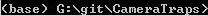
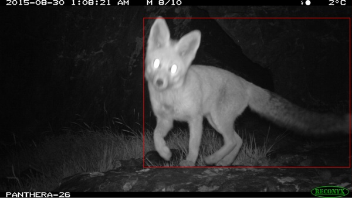

## Table of contents

1. [MegaDetector overview](#megadetector-overview)
2. [Our ask to MegaDetector users](#our-ask-to-megadetector-users)
3. [Who is using MegaDetector?](#who-is-using-megadetector)
4. [How fast is MegaDetector, and can I run it on my giant/small computer?](#how-fast-is-megadetector-and-can-i-run-it-on-my-giantsmall-computer)
5. [Downloading the model](#downloading-the-model)
6. [Using the model](#using-the-model)
7. [Is there a GUI?](#is-there-a-gui)
8.  [How do I use the results?](#how-do-i-use-the-results)
9. [Have you evaluated MegaDetector's accuracy?](#have-you-evaluated-megadetectors-accuracy)
10. [Citing MegaDetector](#citing-megadetector)
11. [Tell me more about why detectors are a good first step for camera trap images](#tell-me-more-about-why-detectors-are-a-good-first-step-for-camera-trap-images)
12. [Pretty picture](#pretty-picture)
13. [Mesmerizing video](#mesmerizing-video)
14. [Can you share the training data?](#can-you-share-the-training-data)


## MegaDetector overview

Conservation biologists invest a huge amount of time reviewing camera trap images, and a huge fraction of that time is spent reviewing images they aren't interested in.  This primarily includes empty images, but for many projects, images of people and vehicles are also "noise", or at least need to be handled separately from animals.

*Machine learning can accelerate this process, letting biologists spend their time on the images that matter.*

To this end, this page hosts a model we've trained - called "MegaDetector" - to detect animals, people, and vehicles in camera trap images.  It does not identify animals to the species level, it just finds them.  

This page is about the technical elements of MegaDetector; if you are an ecologist looking to use MegaDetector, you may prefer to start at our ["Getting started with MegaDetector"](collaborations.md) page.


## Our ask to MegaDetector users

MegaDetector is free, and it makes us super-happy when people use it, so we put it out there as a downloadable model that is easy to use in a variety of conservation scenarios.  That means we don't know who's using it unless you contact us (or we happen to run into you), so please please pretty-please email us at [cameratraps@lila.science](mailto:cameratraps@lila.science) if you find it useful!


## How fast is MegaDetector, and can I run it on my giant/small computer?

We often run MegaDetector on behalf of users as a free service; see our ["Getting started with MegaDetector"](collaborations.md) page for more information.  But there are many reasons to run MegaDetector on your own; how practical this is will depend in part on how many images you need to process and what kind of computer hardware you have available.  MegaDetector is designed to favor accuracy over speed, and we typically run it on <a href="https://en.wikipedia.org/wiki/Graphics_processing_unit">GPU</a>-enabled computers.  That said, you can run anything on anything if you have enough time, and we're happy to support users who run MegaDetector on their own GPUs (in the cloud or on their own PCs), on their own CPUs, or even on embedded devices.  If you only need to process a few thousand images per week, for example, a typical laptop will be just fine.  If you want to crunch through 20 million images as fast as possible, you'll want at least one GPU.

Here are some rules of thumb to help you estimate how fast you can run MegaDetector on different types of hardware.

* On a decent laptop (without a fancy deep learning GPU) that is neither the fastest nor slowest laptop you can buy in 2021, MegaDetector v4 takes somewhere between eight and twenty seconds per image, depending on how many CPUs you use.  This works out to being able to process somewhere between 4,000 and 10,000 image per day.  This might be totally fine for scenarios where you have even hundreds of thousands of images, as long as you can wait a few days.
* On a dedicated deep learning GPU that is neither the fastest nor slowest GPU you can buy in 2021, MegaDetector v4 takes between 0.3 and 0.5 seconds per image, which works out to between 200,000 and 250,000 images per day.  We also include a few <a href="#benchmark-timings">benchmark timings</a> below on some specific GPUs.
* MegaDetector v5 appears to consistently be around 3x-4x faster than MegaDetector v4, but it has not yet been widely benchmarked.

We don't typically recommend running MegaDetector on embedded devices, although <a href="https://www.electromaker.io/project/view/whats-destroying-my-yard-pest-detection-with-raspberry-pi">some folks have done it</a>!  More commonly, for embedded scenarios, it probably makes sense to use MegaDetector to generate bounding boxes on lots of images from your specific ecosystem, then use those boxes to train a smaller model that fits your embedded device's compute budget.

### Benchmark timings

<i>Note that these numbers are for MDv4; we haven't formally benchmarked MDv5 yet, but it's consistently 3x-4x faster than MDv4, so if you're reading this between the release of MDv5 and the next time we update this list, scale accordingly.</i>

With a test batch of around 13,000 images from the public <a href="https://lila.science/datasets/snapshot-karoo">Snapshot Karoo</a> and <a href="http://lila.science/datasets/idaho-camera-traps/">Idaho Camera Traps</a> datasets:

* An <a href="https://www.nvidia.com/en-us/data-center/v100/">NVIDIA V100</a> processes around 2.79 images per second, or around 240,000 images per day (for MDv4)
* An <a href="https://www.nvidia.com/en-us/geforce/graphics-cards/30-series/rtx-3090/">NVIDIA RTX 3090</a> processes ~3.24 images per second, or ~280,000 images per day (for MDv4)
* An <a href="https://www.nvidia.com/en-us/geforce/graphics-cards/rtx-2080-ti/">NVIDIA RTX 2080 Ti</a> processes ~2.48 images per second, or ~214,000 images per day (for MDv4)
* An <a href="https://www.nvidia.com/en-us/geforce/20-series/">NVIDIA RTX 2080</a> processes ~2.0 images per second, or ~171,000 images per day (for MDv4)
* An <a href="https://www.nvidia.com/en-us/geforce/graphics-cards/rtx-2060-super/">NVIDIA RTX 2060 SUPER</a> processes ~1.64 images per second, or ~141,000 images per day (for MDv4)
* An <a href="https://www.nvidia.com/en-us/titan/titan-v/">NVIDIA Titan V</a> processes ~1.9 images per second, or ~167,000 images per day (for MDv4)
* An <a href="https://www.notebookcheck.net/NVIDIA-Quadro-T2000-Laptop-Graphics-Card.423971.0.html">NVIDIA Titan Quadro T2000</a> processes ~0.64 images per second, or ~55,200 images per day (for MDv4)

If you want to run this benchmark on your own, here are <a href="https://github.com/microsoft/CameraTraps/blob/master/download_megadetector_timing_benchmark_set.bat">azcopy commands</a> to download those 13,226 images, and we're happy to help you get MegaDetector running on your setup.  Or if you're using MegaDetector on other images with other GPUs, we'd love to include that data here as well.  <a href="mailto:cameratraps@lila.science">Email us</a>!


## Who is using MegaDetector?

See <a href="https://github.com/microsoft/CameraTraps/#who-is-using-megadetector">this list</a> on the repo's main page.


## Downloading the model

### MegaDetector v5.0, 2022.06.15

#### Release notes

This release incorporates additional training data, specifically aiming to improve our coverage of:

* Boats and trains in the "vehicle" class
* Artificial objects (e.g. bait stations, traps, lures) that frequently overlap with animals
* Rodents, particularly at close range
* Reptiles and small birds

This release also represents a change in MegaDetector's architecture, from Faster-RCNN to [YOLOv5](https://github.com/ultralytics/yolov5).  Our inference scripts have been updated to support both architectures, so the transition should be <i>mostly</i> seamless.

MDv5 is actually two models (MDv5a and MDv5b), differing only in their training data (see the [training data](#can-you-share-the-training-data) section for details).  Both appear to be more accurate than MDv4, and both are 3x-4x faster than MDv4, but each MDv5 model can outperform the other slightly, depending on your data.  Guidelines about which to start with are TBD; we will work with the community to develop these guidelines over the next few months.  When in doubt, for now, try them both.  If you really twist our arms to recommend one... we recommend MDv5a.  But try them both and tell us which works better for you!

See the [release page](https://github.com/microsoft/CameraTraps/releases/tag/v5.0) for more details, and in particular, be aware that the range of confidence values produced by MDv5 is very different from the range of confidence values produced by MDv4!  <i>Don't use your MDv4 confidence thresholds with MDv5!</i>


#### Download links

* [MegaDetector v5a (.pt)](https://github.com/microsoft/CameraTraps/releases/download/v5.0/md_v5a.0.0.pt)
* [MegaDetector v5b (.pt)](https://github.com/microsoft/CameraTraps/releases/download/v5.0/md_v5b.0.0.pt)


### MegaDetector v4.1, 2020.04.27

#### Release notes

This release incorporates additional training data from Borneo, Australia and the [WCS Camera Traps](http://lila.science/datasets/wcscameratraps) dataset, as well as images of humans in both daytime and nighttime. We also have a preliminary "vehicle" class for cars, trucks, and bicycles.

#### Download links

* [Frozen model (.pb)](https://lilablobssc.blob.core.windows.net/models/camera_traps/megadetector/md_v4.1.0/md_v4.1.0.pb)
* [TFODAPI config file](https://lilablobssc.blob.core.windows.net/models/camera_traps/megadetector/md_v4.1.0/md_v4.1.0.config)
* [Last checkpoint (for resuming training)](https://lilablobssc.blob.core.windows.net/models/camera_traps/megadetector/md_v4.1.0/md_v4.1.0_checkpoint.zip)
* [Tensorflow SavedModel for TFServing](https://lilablobssc.blob.core.windows.net/models/camera_traps/megadetector/md_v4.1.0/md_v4.1.0_saved_model.zip) (inputs in uint8 format, `serving_default` output signature)

If you're not sure which format to use, you want the "frozen model" file (the first link).

### MegaDetector v3, 2019.05.30

#### Release notes

In addition to incorporating additional data, this release adds a preliminary "human" class.  Our animal training data is still far more comprehensive than our humans-in-camera-traps data, so if you're interested in using our detector but find that it works better on animals than people, stay tuned.

#### Download links

- [Frozen model (.pb)](https://lilablobssc.blob.core.windows.net/models/camera_traps/megadetector/megadetector_v3.pb)
- [TFODAPI config file](https://lilablobssc.blob.core.windows.net/models/camera_traps/megadetector/megadetector_v3.config)
- [Last checkpoint (for resuming training)](https://lilablobssc.blob.core.windows.net/models/camera_traps/megadetector/megadetector_v3_checkpoint.zip)
- [TensorFlow SavedModel](https://lilablobssc.blob.core.windows.net/models/camera_traps/megadetector/saved_model_normalized_megadetector_v3_tf19.tar.gz) (inputs in TF [common image format](https://www.tensorflow.org/hub/common_signatures/images#image_input), `default` output signature)
- [Tensorflow SavedModel for TFServing](https://lilablobssc.blob.core.windows.net/models/camera_traps/megadetector/saved_model_megadetector_v3_tf19.zip) (inputs in uint8 format, `serving_default` output signature)

### MegaDetector v2, 2018

#### Release notes

First MegaDetector release!

#### Download links

- [Frozen model (.pb)](https://lilablobssc.blob.core.windows.net/models/camera_traps/megadetector/megadetector_v2.pb)
- [TFODAPI config file](https://lilablobssc.blob.core.windows.net/models/camera_traps/megadetector/megadetector_v2.config)
- [Last checkpoint (for resuming training)](https://lilablobssc.blob.core.windows.net/models/camera_traps/megadetector/megadetector_v2_checkpoint.zip)


## Using the model

### Overview

We provide two ways to apply this model to new images:

1. A simple test script that makes neat pictures with bounding boxes, but doesn't produce a useful output file ([run_detector.py](https://github.com/microsoft/CameraTraps/blob/master/detection/run_detector.py))

2. A script for running large batches of images on a local GPU ([run_detector_batch.py](https://github.com/microsoft/CameraTraps/blob/master/detection/run_detector_batch.py))

Before we add more detail, some bonus/third-party/unsupported tools for running MegaDetector:

3. We developed a [batch processing API](https://github.com/microsoft/CameraTraps/tree/master/api/batch_processing) that runs images on many GPUs at once on Azure.  There is no public instance of this API, but the code allows you to stand up your own endpoint.  Likely only useful if you're processing millions of images in frequent, large batches.

4. You can apply MegaDetector to some of your own images in Google Drive using this [Colab notebook](https://github.com/microsoft/CameraTraps/blob/master/detection/megadetector_colab.ipynb).

<p style="margin-left:40px;"><a href="https://colab.research.google.com/github/microsoft/CameraTraps/blob/master/detection/megadetector_colab.ipynb"></a></p>

5. [Ben Evans](https://bencevans.io/) made a [pip-installable wrapper](https://github.com/bencevans/camtrapml) for MegaDetector (and other models).

Also see the <a href="#is-there-a-gui">&ldquo;Is there a GUI?&rdquo;</a> section for graphical options.

The remainder of this section provides instructions for our supported scripts (options 1 and 2 above), including installing all the necessary Python dependencies.

### 1. Install prerequisites: Anaconda, Git, and NVIDIA stuff

All of the instructions that follow assume you have installed [Anaconda](https://www.anaconda.com/products/individual).  Anaconda is an environment for installing and running Python stuff.

The instructions will also assume you have git installed.  If you're not familiar with git, and you are on a Windows machine, we recommend installing [Git for Windows](https://git-scm.com/download/win).

The instructions will assume you are running at an Anaconda prompt.  You will know you are at an Anaconda prompt (as opposed to run-of-the-mill command prompt) if you see an environment name in parentheses before your current directory, like this:



...or this:


On Windows, when you install Anaconda, you will actually get two different Anaconda command prompts; in your start menu, they will be called "Anaconda Prompt (anaconda3)" and "Anaconda Powershell Prompt (anaconda3)".  Either is fine, though we have tested these instructions in the "regular" Anaconda prompt (i.e., not the Powershell prompt).

If you have a deep-learning-friendly GPU, you will also need to have a recent [NVIDIA driver](https://www.nvidia.com/download/index.aspx) installed. 


### 2. Download the MegaDetector model(s)

Download one or more MegaDetector model files ([MDv5a](https://github.com/microsoft/CameraTraps/releases/download/v5.0/md_v5a.0.0.pt), [MDv5b](https://github.com/microsoft/CameraTraps/releases/download/v5.0/md_v5b.0.0.pt), and/or [MDv4](https://lilablobssc.blob.core.windows.net/models/camera_traps/megadetector/md_v4.1.0/md_v4.1.0.pb)) to your computer.  These instructions will assume that you have downloaded MegaDetector to a folder called "c:\megadetector", but if you put it somewhere else, that's fine, just be sure to change it in the steps below that point to a model file.  If you don't care where it goes, and you don't know yet which version you want to use, you'll have an easier time working through these instructions if you download [MDv5a](https://github.com/microsoft/CameraTraps/releases/download/v5.0/md_v5a.0.0.pt) to a folder called "c:\megadetector", i.e. if the model file lives at "c:\megadetector\md_v5a.0.0.pt".

The instructions below will assume that you are using MDv5a; one step will be slightly different for MDv4, but we'll call that out when we get there.


### 3. Clone the relevant git repos and add them to your path, and set up your Python environment

You will need the contents of three git repos to make everything work: this repo, the associated [ai4eutils](https://github.com/microsoft/ai4eutils) repo (some useful file management utilities), and - if you are running MegaDetector v5 - the [https://github.com/ultralytics/yolov5](Yolov5) repo (in fact, a specific snapshot of that repo).  You will also need to set up an Anaconda environment with all the Python packages that our code depends on.

In this section, we provide Windows, Linux, and Mac instructions for doing all of this stuff.


#### Windows instructions for git/Python stuff

The first time you set all of this up, open an Anaconda Prompt, and run:

```batch
mkdir c:\git
cd c:\git
git clone https://github.com/Microsoft/cameratraps
git clone https://github.com/Microsoft/ai4eutils
cd c:\git\cameratraps
conda env create --file environment-detector.yml
conda activate cameratraps-detector
set PYTHONPATH=%PYTHONPATH%;c:\git\cameratraps;c:\git\ai4eutils;c:\git\yolov5

REM ***
REM The rest of this step is specific to MDv5; you can skip the rest of this step if you are
REM only using MDv4.  If you're new to MegaDetector, you probably want MDv5, so you probably
REM want to run the rest of this step.
REM ***
cd c:\git
git clone https://github.com/ultralytics/yolov5/
cd c:\git\yolov5
git checkout c23a441c9df7ca9b1f275e8c8719c949269160d1
cd c:\git\cameratraps
```

If you want to use MDv4, there's one extra setup step (this will not break your MDv5 setup, you can run both in the same environment):

```batch
conda activate cameratraps-detector
pip install tensorflow
```

<a name="windows-new-shell"></a>
Your environment is set up now!  In the future, when you open an Anaconda prompt, you only need to run:

```batch
cd c:\git\cameratraps
conda activate cameratraps-detector
set PYTHONPATH=%PYTHONPATH%;c:\git\cameratraps;c:\git\ai4eutils;c:\git\yolov5
```

Pro tip: if you have administrative access to your machine, rather than using the "set PYTHONPATH" steps, you can also create a permanent PYTHONPATH environment variable.  Here's a [good page](https://www.computerhope.com/issues/ch000549.htm) about editing environment variables in Windows.  But if you just want to "stick to the script" and do it exactly the way we recommend above, that's fine.


#### Linux instructions for git/Python stuff

If you have installed Anaconda on Linux, you are probably always at an Anaconda prompt; i.e., you should see "(base)" at your command prompt.  Assuming you see that, the first time you set all of this up, and run:

```batch
mkdir ~/git
cd ~/git
git clone https://github.com/Microsoft/cameratraps
git clone https://github.com/Microsoft/ai4eutils
cd ~/git/cameratraps
conda env create --file environment-detector.yml
conda activate cameratraps-detector
export PYTHONPATH="$PYTHONPATH:$HOME/git/cameratraps:$HOME/git/ai4eutils:$HOME/git/yolov5"

# ***
# The rest of this step is specific to MDv5; you can skip the rest of this step if you are
# only using MDv4.  If you're new to MegaDetector, you probably want MDv5, so you probably
# want to run the rest of this step.
# ***
cd ~/git
git clone https://github.com/ultralytics/yolov5/
cd ~/git/yolov5
git checkout c23a441c9df7ca9b1f275e8c8719c949269160d1
cd ~/git/cameratraps
```

If you want to use MDv4, there's one extra setup step (this will not break your MDv5 setup, you can run both in the same environment):

```batch
conda activate cameratraps-detector
pip install tensorflow
```

<a name="linux-new-shell"></a>
Your environment is set up now!  In the future, whenever you start a new shell, you just need to do:

```batch
cd ~/git/cameratraps
conda activate cameratraps-detector
export PYTHONPATH="$PYTHONPATH:$HOME/git/cameratraps:$HOME/git/ai4eutils:$HOME/git/yolov5"
```

Pro tip: rather than updating your PYTHONPATH every time you start a new shell, you can add the "export" line to your .bashrc file.


#### Mac instructions for git/Python stuff

These are exactly like the Linux instructions, with just one change, so we're not going to copy and paste, because if we copy and paste, there's a 100% chance the copies will drift out of sync.

So, on a Mac, follow the Linux instructions, but change this line:

`conda env create --file environment-detector.yml`

...to:

`conda env create --file environment-detector-mac.yml`

<i>Advanced information about why there is a different environment file, skip this if you don't want extra detail...</i>

The main environment file (environment-detector.yml) installs the "cudatoolkit" and "cudnn" packages; recent versions of these only exist for Windows and Linux (at least as of June 2022).  So installation using this environment file will fail on a Mac.  On the other hand, if you are on a Mac and you want to use a GPU, you'll need to manually install appropriate versions of the CUDA toolkit and CuDNN.  This is a sufficiently niche scenario that we're not going to get into details about it, but if you are having trouble with this, <a href="mailto:cameratraps@lila.science">email us</a>.


### 4. Hooray, we finally get to run MegaDetector!

#### Reminder of what you need to do every time you start a new shell

If you set up your environment in a previous session, and you're starting a fresh Anaconda shell to run MegaDetector, remember to follow the "whenever you start a new shell" instructions from the previous section (<a href="#windows-new-shell">here</a> for Windows, <a href="#linux-new-shell">here</a> for Linux/Mac).

OK, now for real, let's run MegaDetector.


#### run_detector.py

To test MegaDetector out on small sets of images and get super-satisfying visual output, we provide [run_detector.py](https://github.com/Microsoft/CameraTraps/blob/master/detection/run_detector.py), an example script for invoking this detector on new images.  This isn't how we recommend running lots of images through MegaDetector (see [run_detector_batch.py](#2-run_detector_batchpy) below for "real" usage), but it's a quick way to test things out.  [Let us know](mailto:cameratraps@lila.science) how it works on your images!

The following examples assume you have an Anaconda prompt open, and have put things in the same directories we put things in the above instructions.  If you put things in different places, adjust these examples to match your folders, and most importantly, adjust these examples to point to your images.

To use run_detector.py on Windows:

```batch
cd c:\git\CameraTraps
python detection\run_detector.py "c:\megadetector\md_v5a.0.0.pt" --image_file "some_image_file.jpg" --threshold 0.2
```
Change "some_image_file.jpg" to point to a real image on your computer.

If you ran this script on "some_image_file.jpg", it will produce a file called "some_image_file_detections.jpg", which - if everything worked right - has boxes on objects of interest.

If you have a GPU, and it's being utilized correctly, near the beginning of the output, you should see:

`GPU available: True`

If you see "False" instead, your GPU environment may not be set up correctly; <a href="mailto:cameratraps@lila.science">email us</a> if you need help, or <a href="https://github.com/microsoft/CameraTraps/issues">create an issue on GitHub</a>.

<b>This is really just a test script, you will mostly only use this to make sure your environment is set up correctly</b>.  run_detector_batch.py (see below) is where the interesting stuff happens.

You can see all the options for this script by running:

```batch
python detection\run_detector.py
```

To use this script on Linux/Mac:
 
```batch
cd ~/git/CameraTraps
python detection/run_detector.py "$HOME/megadetector/md_v5a.0.0.pt" --image_file "some_image_file.jpg" --threshold 0.2
```

#### run_detector_batch.py

To apply this model to larger image sets on a single machine, we recommend a different script, [run_detector_batch.py](https://github.com/Microsoft/CameraTraps/blob/master/detection/run_detector_batch.py).  This outputs data in the same format as our [batch processing API](https://github.com/microsoft/CameraTraps/tree/master/api/batch_processing), so you can leverage all of our post-processing tools.  The format that this script produces is also compatible with [Timelapse](https://saul.cpsc.ucalgary.ca/timelapse/).

To use run_detector_batch.py on Windows:

```batch
cd c:\git\CameraTraps
python detection\run_detector_batch.py "c:\megadetector\md_v5a.0.0.pt" "c:\some_image_folder" "c:\megadetector\test_output.json" --output_relative_filenames --recursive --threshold 0.2 --checkpoint_frequency 10000
```

Change "c:\some_image_folder" to point to the real folder on your computer where your images live.

This will produce a file called "c:\megadetector\test_output.json", which - if everything worked right - contains information about where objects of interest are in your images.  You can use that file with any of our [postprocessing](api/batch_processing/postprocessing) scripts, but most users will read this file into [Timelapse](https://saul.cpsc.ucalgary.ca/timelapse/).

<b>If you are running very large batches, we strongly recommend adding the `--checkpoint_frequency` option to save checkpoints every N images</b> (you don't want to lose all the work your GPU has done if your computer crashes!).  10000 is a good value for checkpoint frequency; that will save the results every 10000 images.  This is what we've used in the example above.

If you have a GPU, and it's being utilized correctly, near the beginning of the output, you should see:

`GPU available: True`

If you see "False" instead, your GPU environment may not be set up correctly; <a href="mailto:cameratraps@lila.science">email us</a> if you need help, or <a href="https://github.com/microsoft/CameraTraps/issues">create an issue on GitHub</a>.

You can see all the options for this script by running:

```batch
python detection\run_detector_batch.py
```

To use this script on Linux/Mac:

```batch
cd ~/git/CameraTraps
python detection/run_detector_batch.py "$HOME/megadetector/md_v5a.0.0.pt" "/some/image/folder" "$HOME/megadetector/test_output.json" --output_relative_filenames --recursive --threshold 0.2 --checkpoint_frequency 10000
```


## Is there a GUI?

Not exactly... most of our users either use our Python tools to run MegaDetector or have us run MegaDetector for them (see [this page](collaborations.md) for more information about that), then most of those users use [Timelapse](https://saul.cpsc.ucalgary.ca/timelapse/) to use their MegaDetector results in an image review workflow.

But we recognize that Python tools can be a bit daunting, so we're excited that a few different graphical tools have sprung up that allow you to run MegaDetector in a GUI.  We haven't tried these, but they look great, and if you find them useful - or if you know of others - [let us know](mailto:cameratraps@lila.science)!

As of June 2022, the following interactive tools support MegaDetector v5:

* [Hendry Lydecker](https://github.com/hlydecker) set up a [Hugging Face app](https://huggingface.co/spaces/hlydecker/MegaDetector_v5) for running MDv5

The following support MegaDetector v4 (let us know if any of these adopt MDv5!):

* [EcoAssist](https://github.com/PetervanLunteren/EcoAssist) is a GUI-based tool for running MegaDetector in MacOS environments
* [MegaDetector-GUI](https://github.com/petargyurov/megadetector-gui) is a GUI-based tool for running MegaDetector in Windows environments
* [Ben Evans](https://bencevans.io/) set up a [Web-based MegaDetector demo](https://replicate.com/bencevans/megadetector) at <replicate.com>
* The [Zooniverse ML Subject Assistant](https://subject-assistant.zooniverse.org/#/intro) allows Zooniverse camera trap project owners to run MegaDetector and get "AI votes" on their camera trap images

## How do I use the results?

See the ["How do people use MegaDetector results?"](https://github.com/microsoft/CameraTraps/blob/main/collaborations.md#how-people-use-megadetector-results) section of our "getting started" page.


## Have you evaluated MegaDetector's accuracy?

Internally, we track metrics on a validation set when we train MegaDetector, but we can't stress enough how much performance of any AI system can vary in new environments, so if we told you "99.9999% accurate" or "50% accurate", etc., we would immediately follow that up with "but don't believe us: try it in your environment!"

Consequently, when we work with new users, we always start with a "test batch" to get a sense for how well MegaDetector works for <i>your</i> images.  We make this as quick and painless as possible, so that in the (hopefully rare) cases where MegaDetector will not help you, we find that out quickly.

All of those caveats aside, we are aware of some external validation studies... and we'll list them here... but still, try MegaDetector on your images before you assume any performance numbers!

* Fennell M, Beirne C, Burton AC. [Use of object detection in camera trap image identification: assessing a method to rapidly and accurately classify human and animal detections for research and application in recreation ecology](https://www.sciencedirect.com/science/article/pii/S2351989422001068?via%3Dihub). Global Ecology and Conservation. 2022 Mar 25:e02104.
* Vélez J, Castiblanco-Camacho PJ, Tabak MA, Chalmers C, Fergus P, Fieberg J.  [Choosing an Appropriate Platform and Workflow for Processing Camera Trap Data using Artificial Intelligence](https://arxiv.org/abs/2202.02283). arXiv. 2022 Feb 4.
* [github.com/FFI-Vietnam/camtrap-tools](https://github.com/FFI-Vietnam/camtrap-tools) (includes an evaluation of MegaDetector)

Bonus... this paper is not a formal review, but includes a thorough case study around MegaDetector:

* Tuia D, Kellenberger B, Beery S, Costelloe BR, Zuffi S, Risse B, Mathis A, Mathis MW, van Langevelde F, Burghardt T, Kays R. [Perspectives in machine learning for wildlife conservation](https://www.nature.com/articles/s41467-022-27980-y). Nature Communications. 2022 Feb 9;13(1):1-5.

If you know of other validation studies that have been published, [let us know](mailto:cameratraps@lila.science)!

P.S. Really, don't trust results from one ecosystem and assume they will hold in another. [This paper](https://openaccess.thecvf.com/content_ECCV_2018/html/Beery_Recognition_in_Terra_ECCV_2018_paper.html) is about just how catastrophically bad AI models for camera trap images <i>can</i> fail to generalize to new locations.  We hope that's not the case with MegaDetector!  But don't assume.


## Citing MegaDetector

If you use the MegaDetector in a publication, please cite:
```BibTeX
@article{beery2019efficient,
  title={Efficient Pipeline for Camera Trap Image Review},
  author={Beery, Sara and Morris, Dan and Yang, Siyu},
  journal={arXiv preprint arXiv:1907.06772},
  year={2019}
}
```


## Tell me more about why detectors are a good first step for camera trap images

Can do!  See these [slides](http://dmorris.net/misc/cameratraps/ai4e_camera_traps_overview).


## Pretty picture

Here's a "teaser" image of what detector output looks like:



Image credit University of Washington.


## Mesmerizing video

Here's a neat [video](http://dmorris.net/video/detector_video.html) of our v2 detector running in a variety of ecosystems, on locations unseen during training.

<a href="http://dmorris.net/video/detector_video.html">

</a>

Image credit [eMammal](https://emammal.si.edu/).  Video created by [Sara Beery](https://beerys.github.io/).


## Can you share the training data?

This model is trained on bounding boxes from a variety of ecosystems, and many of the images we use in training can't be shared publicly.  But in addition to the private training data we use, we also use many of the bounding boxes available on lila.science:

<https://lila.science/category/camera-traps/>

Each version of MegaDetector uses all the training data from the previous version, plus a bunch of new stuff.  Specifically...

MegaDetector v2 was trained on... actually, we don't remember, that was before the dawn of time.

MegaDetector v3 was trained on private data, plus public data from:

* [Caltech Camera Traps](https://lila.science/datasets/caltech-camera-traps)
* [Snapshot Serengeti](https://lila.science/datasets/snapshot-serengeti)
* [Idaho Camera Traps](https://lila.science/datasets/idaho-camera-traps/)

MegaDetector v4 was trained on all MDv3 training data, plus new private data, and new public data from:

* [WCS Camera Traps](https://lila.science/datasets/wcscameratraps)
* [NACTI (North American Camera Trap Images)](https://lila.science/datasets/nacti)
* [Island Conservation Camera Traps](https://lila.science/datasets/island-conservation-camera-traps)

MegaDetector v5b was trained on all MDv4 training data, plus new private data, and new public data from:

* [Orinoquía Camera Traps](https://lila.science/orinoquia-camera-traps/)
* [SWG Camera Traps](https://lila.science/datasets/swg-camera-traps)
* [ENA24](https://lila.science/datasets/ena24detection)
* [Several datasets from Snapshot Safari](https://lila.science/category/camera-traps/snapshot-safari/)

MegaDetector v5a was trained on all MDv5b training data, and new public data from:

* The [iNaturalist Dataset 2017](https://github.com/visipedia/inat_comp/tree/master/2017)
* [COCO](https://cocodataset.org/#home)

So if MegaDetector performs really well on those data sets, that's great, but it's a little bit cheating, because we haven't published the set of locations from those data sets that we use during training.
